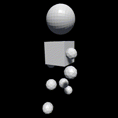

# VRM Add-on for Blender <a href="https://github.com/saturday06/VRM_Addon_for_Blender/actions"></a> <a href="https://github.com/psf/black"></a>

BlenderにVRM関連機能を追加するアドオンです。<strong>2021年2月7日のリリースでアドオン名(旧名:VRM_IMPORTER_for_Blender)とインストール方法が変わりました。ご注意ください。アップデートの際は古いアドオンを削除お願いします。</strong>


VRM Add-on for Blender is an add-on that adds VRM-related functions to Blender.
<strong>Please note that the add-on name (ex-VRM_IMPORTER_for_Blender) and its installation method have changed since the release on February 7, 2021. Please remove the old add-on when updating.</strong>

<a alt="Download add-on for Blender 2.82+" href="https://github.com/saturday06/VRM_Addon_for_Blender/raw/release-archive/VRM_Addon_for_Blender-release.zip"></a>

# Installation / インストール方法


# Tutorials / チュートリアル

| [Create Simple VRM / 単純なVRMを作る](https://vrm-addon-for-blender.info/en/create-simple-vrm-from-scratch?locale_redirection) | [Create Humanoid VRM / 人型のVRMを作る](https://vrm-addon-for-blender.info/en/create-humanoid-vrm-from-scratch?locale_redirection) |
| :---: | :---: |
| [](https://vrm-addon-for-blender.info/en/create-simple-vrm-from-scratch?locale_redirection) | [](https://vrm-addon-for-blender.info/en/create-humanoid-vrm-from-scratch?locale_redirection) |

# Development / 開発するには

`io_scene_vrm` フォルダがBlenderアドオンの本体になります。そのフォルダへのリンクをBlenderの `addons` フォルダ内に作ることで効率的に開発をすることができます。

The `io_scene_vrm` folder is the main body of the Blender add-on. For efficient development, you can create a link to that folder in the Blender `addons` folder.

```
# Linux
ln -s "$PWD/io_scene_vrm" "$HOME/.config/blender/BLENDER_VERSION/scripts/addons/VRM_Addon_for_Blender-repo"
# macOS
ln -s "$PWD/io_scene_vrm" "$HOME/Library/Application Support/Blender/BLENDER_VERSION/scripts/addons/VRM_Addon_for_Blender-repo"
# Windows
mklink /j "%APPDATA%\Blender Foundation\Blender\BLENDER_VERSION\scripts\addons\VRM_Addon_for_Blender-repo" io_scene_vrm
```

テストの実行などより高度な開発をする場合はPoetry https://python-poetry.org/ をご利用ください。

For more advanced development, such as running tests, please use Poetry https://python-poetry.org/ .

# Documentation / ドキュメント

[https://vrm-addon-for-blender.info](https://vrm-addon-for-blender.info)
