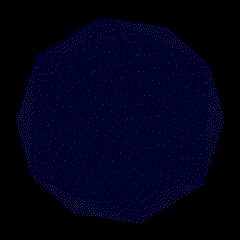
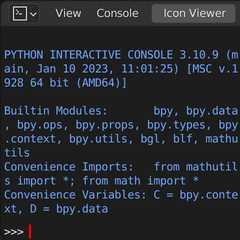

<a name="en" />

[ English / [日本語](#ja_JP) ]

# VRM Add-on for Blender [](https://github.com/saturday06/VRM-Addon-for-Blender/actions) [](https://github.com/astral-sh/uv)

VRM Add-on for Blender is an add-on that adds VRM-related functionality to
Blender.

## Download

- For Blender 4.2 or later:
  [🛠️**Blender Extensions Platform**](https://extensions.blender.org/add-ons/vrm).
- For Blender 2.93 to 4.1:
  [🌐**The Official Site**](https://vrm-addon-for-blender.info).

## Tutorials

|                               [Installation](https://vrm-addon-for-blender.info/en-us/installation)                               |                        [Create Simple VRM](https://vrm-addon-for-blender.info/en-us/create-simple-vrm-from-scratch)                         |                        [Create Humanoid VRM](https://vrm-addon-for-blender.info/en-us/create-humanoid-vrm-from-scratch)                         |
| :-------------------------------------------------------------------------------------------------------------------------------: | :-----------------------------------------------------------------------------------------------------------------------------------------: | :---------------------------------------------------------------------------------------------------------------------------------------------: |
|  <a href="https://vrm-addon-for-blender.info/en-us/installation"></a>  | <a href="https://vrm-addon-for-blender.info/en-us/create-simple-vrm-from-scratch"></a> | <a href="https://vrm-addon-for-blender.info/en-us/create-humanoid-vrm-from-scratch"></a> |
|                    **[Create Physics-Based Material](https://vrm-addon-for-blender.info/en-us/material-pbr)**                     |                         **[Create Anime-Style Material](https://vrm-addon-for-blender.info/en-us/material-mtoon)**                          |                                     **[VRM Animation](https://vrm-addon-for-blender.info/en-us/animation)**                                     |
|  <a href="https://vrm-addon-for-blender.info/en-us/material-pbr"></a>  |     <a href="https://vrm-addon-for-blender.info/en-us/material-mtoon"></a>     |            <a href="https://vrm-addon-for-blender.info/en-us/animation"></a>            |
|                   **[Automation with Python Scripts](https://vrm-addon-for-blender.info/en-us/scripting-api)**                    |                               **[Development How-To](https://vrm-addon-for-blender.info/en-us/development)**                                |                                                                                                                                                 |
| <a href="https://vrm-addon-for-blender.info/en-us/scripting-api"></a> |        <a href="https://vrm-addon-for-blender.info/en-us/development"></a>        |                                                                                                                                                 |

## Overview

This add-on adds VRM-related functionality to Blender, including importing and
exporting VRM files, adding VRM Humanoid, and configuring MToon shaders. Bug
reports, feature requests, pull requests, and contributions are welcome. I have
taken over development after
[Version 0.79](https://github.com/iCyP/VRM_IMPORTER_for_Blender2_8/releases/tag/0.79)
from the original author, [@iCyP](https://github.com/iCyP).

## Development

The
[`src/io_scene_vrm`](https://github.com/saturday06/VRM-Addon-for-Blender/tree/main/src/io_scene_vrm)
folder contains the main add-on code. By creating a symbolic link to this folder
in Blender's `user_default` or `addons` directory, you can install the
development source code as an add-on in Blender, making it easy to test changes
efficiently.

For advanced development tasks such as running tests, refer to the
[development environment setup documentation](https://vrm-addon-for-blender.info/en-us/development).

### How to create a development link for Blender 4.2 or later

#### Linux

```sh
blender_version=4.5
mkdir -p "$HOME/.config/blender/$blender_version/extensions/user_default"
ln -Ts "$PWD/src/io_scene_vrm" "$HOME/.config/blender/$blender_version/extensions/user_default/vrm"
```

#### macOS

```sh
blender_version=4.5
mkdir -p "$HOME/Library/Application Support/Blender/$blender_version/extensions/user_default"
ln -s "$PWD/src/io_scene_vrm" "$HOME/Library/Application Support/Blender/$blender_version/extensions/user_default/vrm"
```

#### Windows PowerShell

```powershell
$blenderVersion = 4.5
New-Item -ItemType Directory -Path "$Env:APPDATA\Blender Foundation\Blender\$blenderVersion\extensions\user_default" -Force
New-Item -ItemType Junction -Path "$Env:APPDATA\Blender Foundation\Blender\$blenderVersion\extensions\user_default\vrm" -Value "$(Get-Location)\src\io_scene_vrm"
```

### How to create a development link for Blender 4.1.1 or earlier

#### Linux

```sh
blender_version=4.5
mkdir -p "$HOME/.config/blender/$blender_version/scripts/addons"
ln -Ts "$PWD/src/io_scene_vrm" "$HOME/.config/blender/$blender_version/scripts/addons/io_scene_vrm"
```

#### macOS

```sh
blender_version=4.5
mkdir -p "$HOME/Library/Application Support/Blender/$blender_version/scripts/addons"
ln -s "$PWD/src/io_scene_vrm" "$HOME/Library/Application Support/Blender/$blender_version/scripts/addons/io_scene_vrm"
```

#### Windows PowerShell

```powershell
$blenderVersion = 4.5
New-Item -ItemType Directory -Path "$Env:APPDATA\Blender Foundation\Blender\$blenderVersion\scripts\addons" -Force
New-Item -ItemType Junction -Path "$Env:APPDATA\Blender Foundation\Blender\$blenderVersion\scripts\addons\io_scene_vrm" -Value "$(Get-Location)\src\io_scene_vrm"
```

---

<a name="ja_JP" />

[ [English](#en) / 日本語 ]

# VRM Add-on for Blender [](https://github.com/saturday06/VRM-Addon-for-Blender/actions) [](https://github.com/astral-sh/uv)

BlenderにVRM関連機能を追加するアドオンです。

## ダウンロード

- Blender 4.2以上をお使いの場合:
  [🛠️**Blender Extensions Platform**](https://extensions.blender.org/add-ons/vrm)
- Blender 2.93から4.1をお使いの場合:
  [🌐**オフィシャルWebサイト**](https://vrm-addon-for-blender.info)

## チュートリアル

|                             [インストール方法](https://vrm-addon-for-blender.info/ja-jp/installation)                             |                       [シンプルなVRMを作る](https://vrm-addon-for-blender.info/ja-jp/create-simple-vrm-from-scratch)                        |                          [人型のVRMを作る](https://vrm-addon-for-blender.info/ja-jp/create-humanoid-vrm-from-scratch)                           |
| :-------------------------------------------------------------------------------------------------------------------------------: | :-----------------------------------------------------------------------------------------------------------------------------------------: | :---------------------------------------------------------------------------------------------------------------------------------------------: |
|  <a href="https://vrm-addon-for-blender.info/ja-jp/installation"></a>  | <a href="https://vrm-addon-for-blender.info/ja-jp/create-simple-vrm-from-scratch"></a> | <a href="https://vrm-addon-for-blender.info/ja-jp/create-humanoid-vrm-from-scratch"></a> |
|                      **[物理ベースのマテリアル設定](https://vrm-addon-for-blender.info/ja-jp/material-pbr)**                      |                           **[アニメ風のマテリアル設定](https://vrm-addon-for-blender.info/ja-jp/material-mtoon)**                           |                                   **[VRMアニメーション](https://vrm-addon-for-blender.info/ja-jp/animation)**                                   |
|  <a href="https://vrm-addon-for-blender.info/ja-jp/material-pbr"></a>  |     <a href="https://vrm-addon-for-blender.info/ja-jp/material-mtoon"></a>     |            <a href="https://vrm-addon-for-blender.info/ja-jp/animation"></a>            |
|                    **[Pythonスクリプトによる自動化](https://vrm-addon-for-blender.info/ja-jp/scripting-api)**                     |                                  **[改造するには?](https://vrm-addon-for-blender.info/ja-jp/development)**                                  |                                                                                                                                                 |
| <a href="https://vrm-addon-for-blender.info/ja-jp/scripting-api"></a> |        <a href="https://vrm-addon-for-blender.info/ja-jp/development"></a>        |                                                                                                                                                 |

## 概要

BlenderにVRMのインポートやエクスポート、VRM
Humanoidの追加やMToonシェーダーの設定などのVRM関連機能を追加するアドオンです。バグ報告、機能要望、Pull
Request等歓迎します。[バージョン 0.79](https://github.com/iCyP/VRM_IMPORTER_for_Blender2_8/releases/tag/0.79)以降の開発を作者である[@iCyP](https://github.com/iCyP)さんから引き継ぎました。

## 改造するには

[`src/io_scene_vrm`](https://github.com/saturday06/VRM-Addon-for-Blender/tree/main/src/io_scene_vrm)
フォルダがアドオン本体です。 そのフォルダへのリンクをBlenderの `user_default`
あるいは `addons` フォルダ内に作ることで、
開発中のソースコードをBlenderにアドオンとしてインストールした扱いにすることができ、
効率的に動作確認をすることができるようになります。

テストの実行など、より高度な開発をする場合は[開発環境のセットアップ方法のドキュメント](https://vrm-addon-for-blender.info/ja-jp/development)にあります。

### Blender 4.2以上向けの、開発用リンクの作成方法

#### Linux

```sh
blender_version=4.5
mkdir -p "$HOME/.config/blender/$blender_version/extensions/user_default"
ln -Ts "$PWD/src/io_scene_vrm" "$HOME/.config/blender/$blender_version/extensions/user_default/vrm"
```

#### macOS

```sh
blender_version=4.5
mkdir -p "$HOME/Library/Application Support/Blender/$blender_version/extensions/user_default"
ln -s "$PWD/src/io_scene_vrm" "$HOME/Library/Application Support/Blender/$blender_version/extensions/user_default/vrm"
```

#### Windows PowerShell

```powershell
$blenderVersion = 4.5
New-Item -ItemType Directory -Path "$Env:APPDATA\Blender Foundation\Blender\$blenderVersion\extensions\user_default" -Force
New-Item -ItemType Junction -Path "$Env:APPDATA\Blender Foundation\Blender\$blenderVersion\extensions\user_default\vrm" -Value "$(Get-Location)\src\io_scene_vrm"
```

### Blender 4.2未満向けの、開発用リンクの作成方法

#### Linux

```sh
blender_version=4.5
mkdir -p "$HOME/.config/blender/$blender_version/scripts/addons"
ln -Ts "$PWD/src/io_scene_vrm" "$HOME/.config/blender/$blender_version/scripts/addons/io_scene_vrm"
```

#### macOS

```sh
blender_version=4.5
mkdir -p "$HOME/Library/Application Support/Blender/$blender_version/scripts/addons"
ln -s "$PWD/src/io_scene_vrm" "$HOME/Library/Application Support/Blender/$blender_version/scripts/addons/io_scene_vrm"
```

#### Windows PowerShell

```powershell
$blenderVersion = 4.5
New-Item -ItemType Directory -Path "$Env:APPDATA\Blender Foundation\Blender\$blenderVersion\scripts\addons" -Force
New-Item -ItemType Junction -Path "$Env:APPDATA\Blender Foundation\Blender\$blenderVersion\scripts\addons\io_scene_vrm" -Value "$(Get-Location)\src\io_scene_vrm"
```
