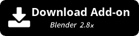
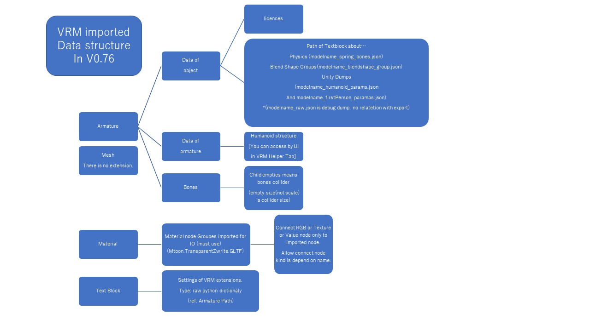

# VRM_IMPORTER_for_Blender2.8

Upstreamのレポジトリ https://github.com/iCyP/VRM_IMPORTER_for_Blender2_8 の更新が終了してしまったため、勉強ついでにメンテナンスしてみようという試みです。バグ報告、機能要望、Pull request等歓迎します。

- current : for blender 2.82 - 2.83
- mesh import : done 
- material import : wip forever
- export : spec0.0 export may be possible.

# ATTENTION 注意
If you using minisize cloud storage, texture folder explanation must read and care about storage remaining capacity.

小さいクラウドストレージに保存しているVRMをインポートしている場合下記の中のテクスチャフォルダの扱いをよく読み、残容量に気を付けてご利用ください。

# 機能
- VRM import
  - VRMの物理拡張などの設定はblender内蔵テキストエディタに出力、アーマチュアのオブジェクトカスタムプロパティにそのパスが書かれます
  - モデルライセンスはアーマチュアのオブジェクトカスタムプロパティに出力されます
  - humanoidボーン属性はVRM HELPERタブからアクセス可能です
  - これらはVRMエクスポート時に利用されます(詳しくは下部の図を参照
  - 10フォルダを上限にインポートごとに新たなテクスチャフォルダを作成する。(デフォルト動作) インポートウィンドウのオプションで->単一のテクスチャフォルダに存在しないテクスチャだけ書き込む仕様になりました。title,author,versionが設定していないと適当なフォルダ名で生成します。
  - インポート時に自動でAutoIK用のボーンのセットアップを行います。もとのコードは[こちらで配布されているもの](https://booth.pm/ja/items/1697977)で、作者様から許可をいただきマージしました。
- VRM 向けシェーダーノードグループ追加(※モックアップ程度の出来)(GLTF,MToon_unversioned,TransparentZwrite)
- VRM 向けhumanoid Armature 追加(これを使わないとexport出来ません)(絶対に出来ないとは言ってないけど圧倒的に楽)
- VRM0.0(のような何かの) export 完全ではないので、出力後にUniVRMを通してください。(他形式でUniVRMに渡すより物理やマテリアル、blendshape_groupの情報が多く残るのでマシ程度にお考え下さい
- VRM export チュートリアル(japanese)
  https://www.nicovideo.jp/watch/sm36033523

# function
- VRM import
  - This addon makes texture folder for import each times (max:10) name based on VRM title,author,model version.
- Add VRM like shader as Node Group (Please use these node group and direct link it to TEX_IMAGE,RGBA,VALUE and Material output Nodes for export)
- Add humanoid armature for VRM(Tpose, required bone, and append custom properties to need export VRM (reference to VRM extensions textblock ,and bone tagging))
- VRM0.0 export (not complete function ,but easy to bridge UniVRM. )

# VRM編集チュートリアル (VRM-in-out modify video tutorial(Japanese))
https://www.nicovideo.jp/watch/sm36033523
## more detail for VRM export
https://qiita.com/iCyP/items/61af0ea93c604e37bed6

# GLTF extension implements
- KHR_materials_unlit : OK
- KHR_materials_pbrSpecularGlossiness: NO
- KHR_texture_transform : NO
- KHR_draco_mesh_compression: CAN'T
- KHR_techniques_webgl: IGNORE
- KHR_lights_punctual: IGNORE
- VENDER'S extension : NO without VRM

# Spec

