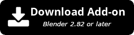
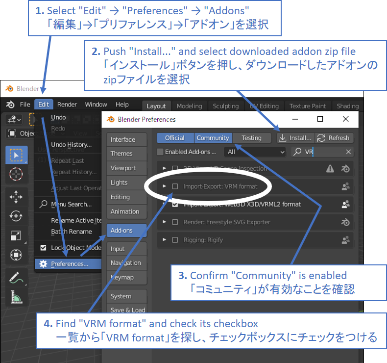

# VRM Add-on for Blender  

BlenderにVRM関連機能を追加するアドオンです。<strong>2021年2月7日のリリースでアドオン名(旧名:VRM_IMPORTER_for_Blender)とインストール方法が変わりました。ご注意ください。アップデートの際は古いアドオンを削除お願いします。</strong>

An add-on that adds VRM-related functions to Blender. <strong>Please note that the add-on name (ex-VRM_IMPORTER_for_Blender) and its installation method has changed since the release on February 7, 2021. Please remove the old add-on when updating.</strong>

# Installation / インストール方法

# Overview / 概要

BlenderにVRMのインポートやエクスポート、VRM Humanoidの追加などのVRM関連機能を追加するアドオンです。バグ報告、機能要望、Pull request等歓迎します。[バージョン 0.79](https://github.com/saturday06/VRM_Addon_for_Blender/archive/0_79.zip)以降の開発をオリジナル版のメンテナである[@iCyP](https://github.com/iCyP)さんから引き継がせていただきました。

# Functions / 機能

## Import / インポート

- VRMの物理拡張などの設定は Blender内蔵テキストエディタに出力、アーマチュアのオブジェクトカスタムプロパティにそのパスが書かれます
- モデルライセンスはアーマチュアのオブジェクトカスタムプロパティに出力されます
- Humanoidボーン属性はVRMタブからアクセス可能です
- これらはVRMエクスポート時に利用されます(詳しくは下部の図を参照
- 「テクスチャ画像をフォルダに展開」オプションを有効にすると、100,000フォルダを上限にインポートごとに新たなテクスチャフォルダを作成する。インポートウィンドウのオプションで単一のテクスチャフォルダに存在しないテクスチャだけ書き込む仕様になりました。
- If "Extract texture images into the folder" option enabled this add-on makes texture folder for import each times (max:100,000) name.
- インポート時に自動でAutoIK用のボーンのセットアップを行います。もとのコードは[こちらで配布されているもの](https://booth.pm/ja/items/1697977)で、作者様から許可をいただきマージしました。

## Edit / 編集

- VRM向けシェーダーノードグループ追加(※モックアップ程度の出来)(GLTF,MToon_unversioned,TransparentZwrite)
- Add VRM like shader as Node Group (GLTF,MToon_unversioned,TransparentZwrite)(Please use these node group and direct link it to TEX_IMAGE,RGBA,VALUE and Material output Nodes for export)
- VRM向けHumanoid Armature追加機能(これを使わないとエクスポート出来ません)(絶対に出来ないとは言ってないけど圧倒的に楽)
- Add humanoid armature for VRM(Tpose, required bone, and append custom properties to need export VRM (reference to VRM extensions textblock ,and bone tagging))

## Export / エクスポート

- VRM0.0(のような何かの)export。完全ではないので、出力後にUniVRMを通してください。(他形式で UniVRMに渡すより物理やマテリアル、blendshape_groupの情報が多く残るのでマシ程度にお考え下さい
- VRM0.0 export (not complete function, but easy to bridge UniVRM.)

# Appendix / その他資料

## More detail for VRM export (Japanese) / 詳細解説

https://qiita.com/iCyP/items/61af0ea93c604e37bed6

## VRM-in-out modify video tutorial (Japanese) / VRM編集の動画チュートリアル

https://www.nicovideo.jp/watch/sm36033523

## glTF extension implements / glTFエクステンションの対応状況

- KHR_materials_unlit : ok
- KHR_materials_pbrSpecularGlossiness: no
- KHR_texture_transform : no
- KHR_draco_mesh_compression: can't
- KHR_techniques_webgl: ignore
- KHR_lights_punctual: ignore
- Vendor's extension : no without VRM

## Spec / 仕様

