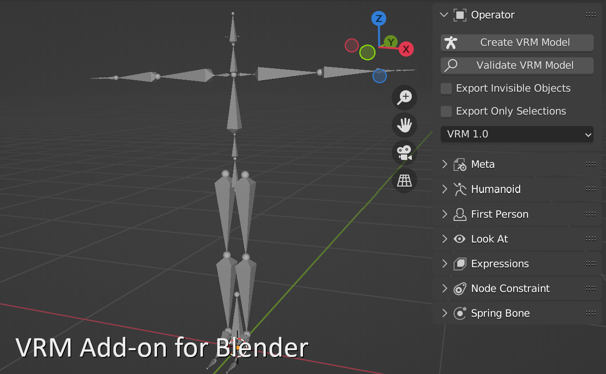

{.logo}

VRM Add-on for Blender adds VRM import, export, and editing capabilities to
Blender. It supports Blender versions 2.93 to 4.5.

## Download {#download}

- For Blender 4.2 or later, please download from
  [Blender Extensions Platform](https://extensions.blender.org/add-ons/vrm).
- For Blender 2.93 to 4.1: <DownloadLink />\
  <small>[Past Releases](https://github.com/saturday06/VRM-Addon-for-Blender/releases)</small>

## Tutorials

| [Installation](installation/)                                      | [Create Simple VRM](create-simple-vrm-from-scratch/)                         | [Create Humanoid VRM](create-humanoid-vrm-from-scratch/)                         |
| ------------------------------------------------------------------ | ---------------------------------------------------------------------------- | -------------------------------------------------------------------------------- |
| [{.tutorial}](installation/)   | [{.tutorial}](create-simple-vrm-from-scratch/) | [{.tutorial}](create-humanoid-vrm-from-scratch/) |
| [Create Physics Based Material](material-pbr/)                     | [Create Anime Style Material](material-mtoon/)                               | [VRM Animation](animation/)                                                      |
| [{.tutorial}](material-pbr/)   | [{.tutorial}](material-mtoon/)         | [{.tutorial}](animation/)                       |
| [Automation with Python scripts](scripting-api/)                   | [Development How-To](development/)                                           |                                                                                  |
| [{.tutorial}](scripting-api/) | [{.tutorial}](development/)               |                                                                                  |

## Overview

This add-on adds VRM-related functions to Blender, such as importing and
exporting VRM, adding VRM Humanoid and setting MToon shaders. Bug reports,
feature requests, pull requests, etc. are welcome. I have taken over the
development after
[Version 0.79](https://github.com/iCyP/VRM_IMPORTER_for_Blender2_8/releases/tag/0.79)
from the author, [@iCyP](https://github.com/iCyP).
