This tutorial explains how to install VRM Add-on for Blender.

The steps vary depending on your Blender version and where you download from.
Choose one of the following three methods. {#installation-methods}

- [Blender 4.2 or later, download from Blender Preferences](#installation-4.2-or-later-online)
- [Blender 4.2 or later, download from a web browser](#installation-4.2-or-later-offline)
- [Blender 2.93 to 4.1](#installation-2.93-to-4.1)

## Blender 4.2 or later, download from Blender Preferences <a id="installation-4.2-or-later-online"/> {#installation-4.2-or-later-online}

In Blender 4.2 and later, you can download and install from the Preferences
window. When updates are available, you can also update by clicking a button in
the Preferences window.

Start Blender, then select `Edit` → `Preferences` from the menu.

In the Preferences window, select `Get Extensions` from the left menu.

If you see a message saying that installing or updating online extensions
requires internet access, click `Allow Online Access`.

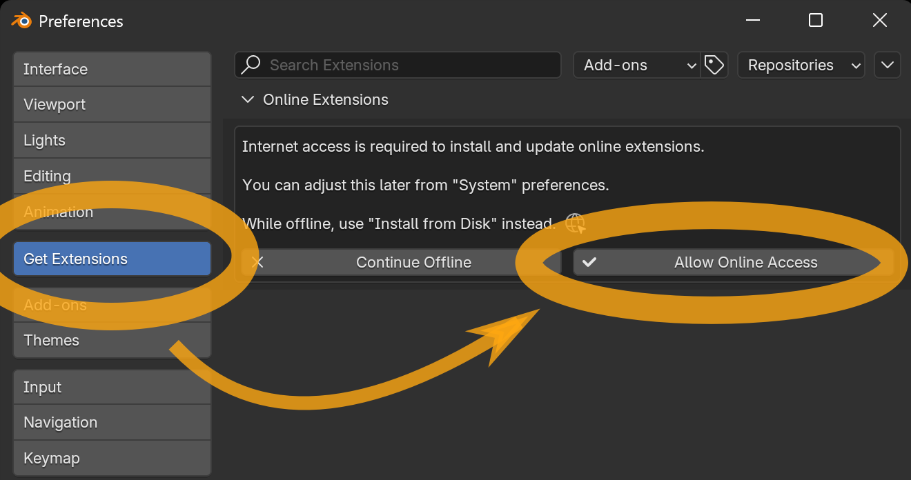

> [!TIP]
> Clicking `Allow Online Access` lets Blender communicate with the internet. If
> you do not want to allow this, install via
> [Blender 4.2 or later, download from a web browser](#installation-4.2-or-later-offline).

After a moment, the "Available" list appears. Find the `VRM format` entry. If
the list is long, you can filter it by typing `VRM` into the search box at the
top.

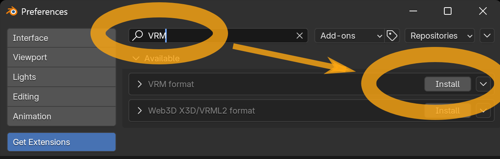

Click `Install` to complete the installation.

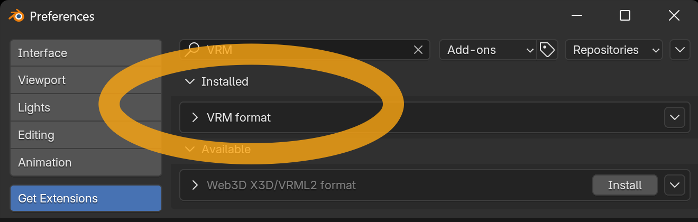

If nothing appears in the list, online access may be disabled. In the
Preferences window, select `System`, turn on `Allow Online Access`, then select
`Get Extensions` again.

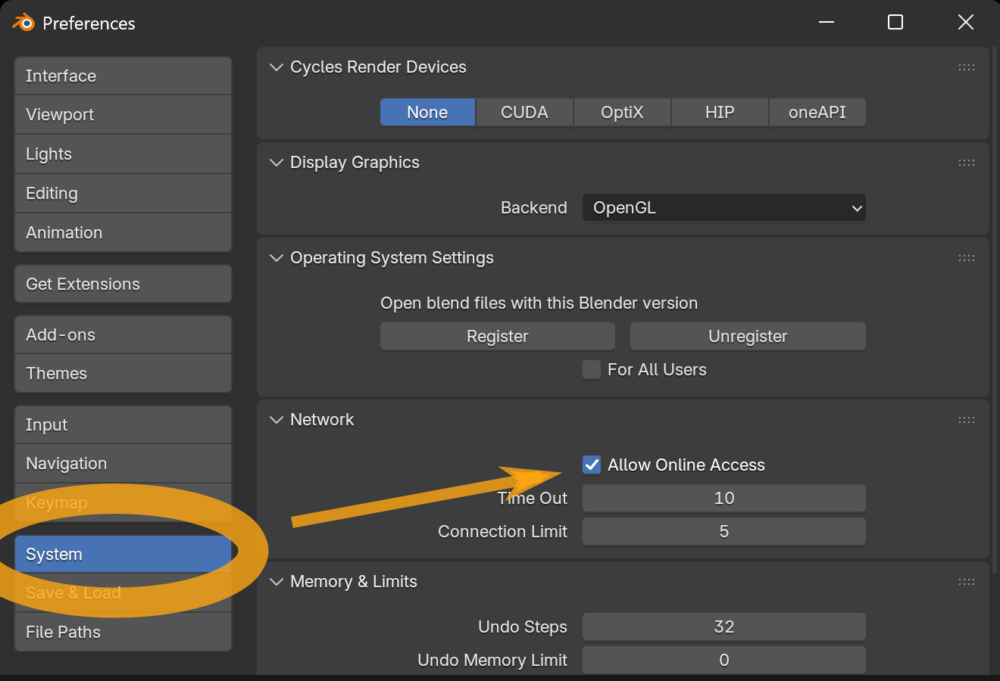

If it still does not appear, check your internet access. Blender’s online
services might also be down. You can check the status at
https://status.blender.org/status/public.

## Blender 4.2 or later, download from a web browser <a id="installation-4.2-or-later-offline"/> {#installation-4.2-or-later-offline}

If you want to keep Blender’s online access disabled, download the add-on file
in a web browser and add it from the Preferences window. First, open the
[Blender Extensions Platform](https://extensions.blender.org/add-ons/vrm/).

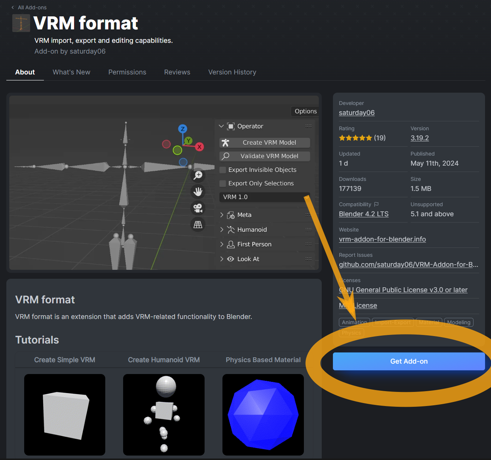

Click the `Get Add-on` button.

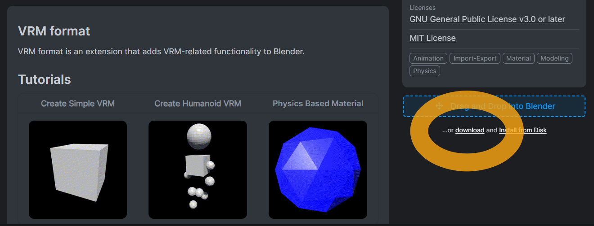

A `download` link appears. Click it to download the add-on file.

> [!TIP]
> The downloaded add-on file is a ZIP file, but <u>please do not unzip it</u>,
> as the unzipped data will not function as an add-on.

> [!INFO]
> You can also install by following the `Drag and Drop into Blender` instruction
> on the website, but that requires allowing Blender online access.

Next, start Blender and select `Edit` → `Preferences` from the menu.

In the Preferences window, select `Add-ons` from the left menu, then click the
`˅` button in the top right and choose `Install from Disk` from the menu.

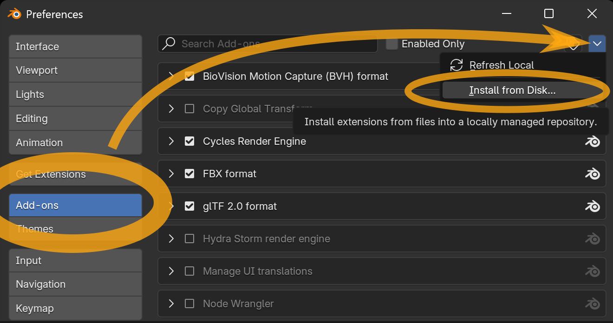

A file picker opens. Select the add-on file you downloaded earlier, confirm the
filename ends with `.zip`, then click `Install from Disk`.

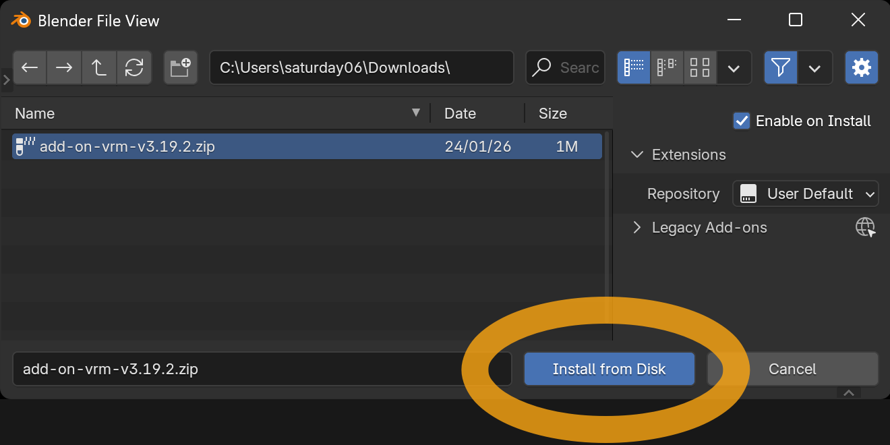

If `VRM format` is added to the list and its checkbox is `on`, installation is
complete.

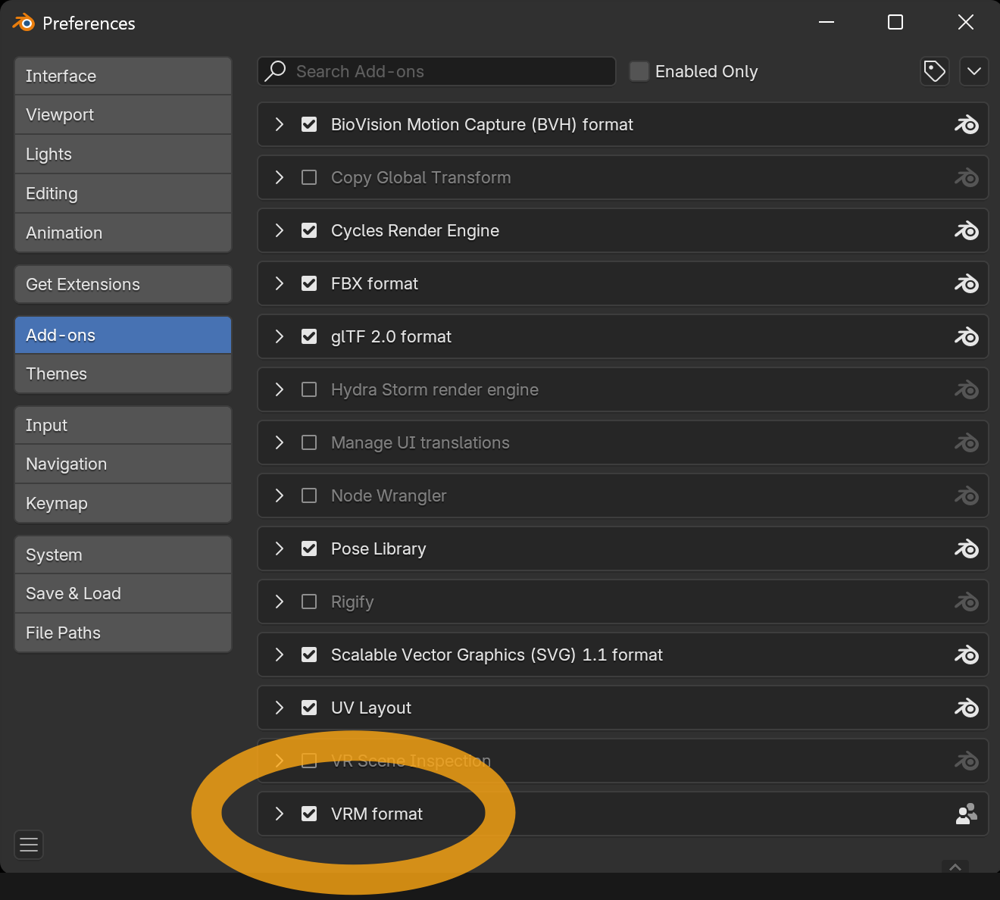

If the checkbox is `off`, turn it `on` manually.

If `VRM format` is not added to the list, confirm the following:

- The add-on file you downloaded is a ZIP file, but <u>you did not unzip it</u>.
- The selected add-on filename ends with `.zip`.

## Blender 2.93 to 4.1 <a id="installation-2.93-to-4.1"/> {#installation-2.93-to-4.1}

Download latest add-on file from <DownloadLink />

> [!TIP]
> The downloaded add-on file is a ZIP file, but <u>please do not unzip it</u>,
> as the unzipped data will not function as an add-on.

Start Blender and select menu `Edit` → `Preferences`.

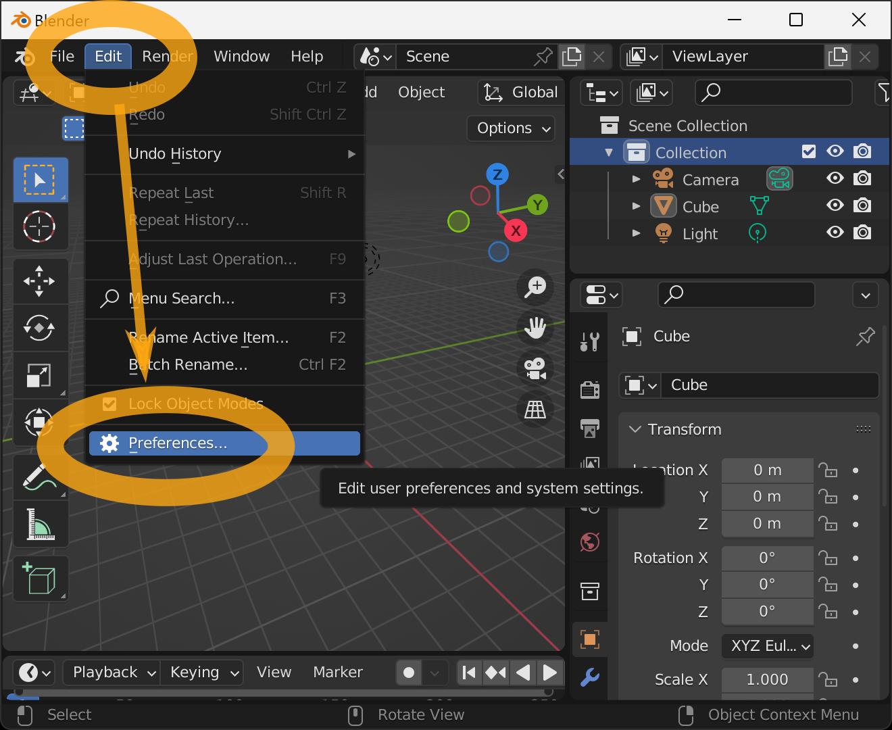

Select `Add-ons` from the left menu when the preferences screen, and then press
the `Install` button in the upper right corner.

When the File View window appears, select the add-on file you just downloaded,
make sure the filename ends with `.zip`, and press the `Install Add-on` button.

Make sure `Community` is enabled.

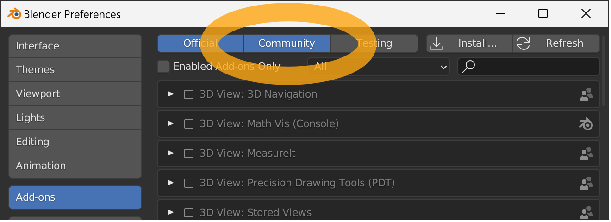

Find `Import-Export: VRM format` in the add-on list view.

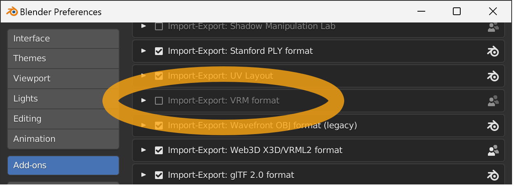

There is a search box in the upper right corner if there are too many items to
find.

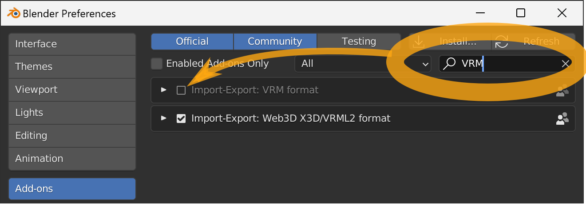

If you cannot find it, please make sure that all of the following conditions are
met

- The add-on file you downloaded is a ZIP file, but <u>you did not unzip it</u>.
- The selected add-on filename ends with `.zip`.
- `Community` at the top of the window is enabled.

Press the checkbox to complete the installation of the add-on.

