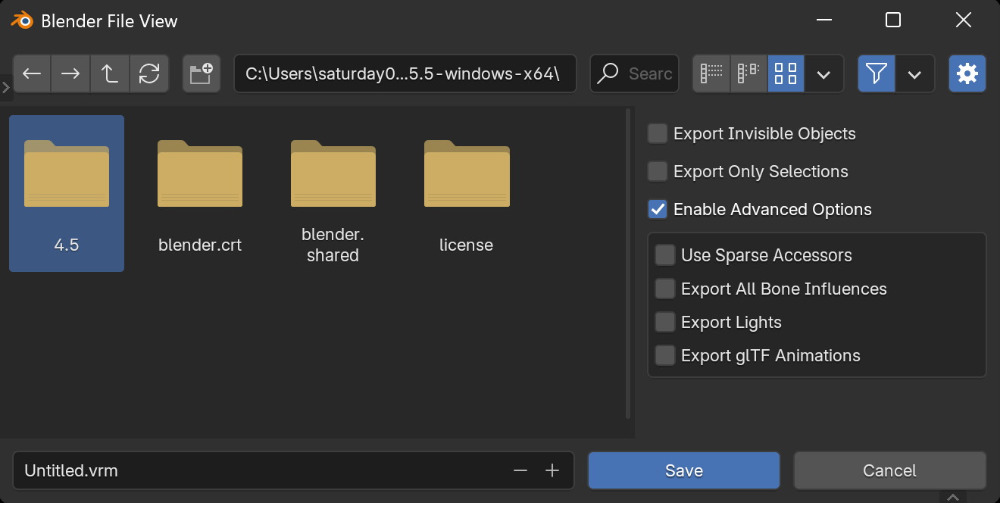

Select `File` → `Export` → `VRM (.vrm)` from the menu to display the VRM export
dialog. Press the `Save` button to export the currently edited armature as a VRM
file.

#### ✅ Export Invisible Objects

Include invisible objects during export. As an exception, the target armature
for export will be exported even if it is invisible.

#### ✅ Export Only Selections

Export only the selected objects.

#### ✅ Enable Advanced Options

Enable the [Advanced Options] items. Please note that changing these items may
result in a loss of compatibility of the VRM file between applications.

#### ✅ [Advanced Options] [VRM 1.0 only] Use Sparse Accessors

Use sparse accessors when exporting shape keys. This may reduce file size for
models using shape keys, but VRM files will become unreadable in older
applications using
[UniVRM 0.115.0 or earlier](https://github.com/saturday06/VRM-Addon-for-Blender/issues/381#issuecomment-1838365762).

#### ✅ [Advanced Options] [VRM 1.0 only] Export All Bone Influences

Export all bone weights. By default, the number of exported weights is limited
to 4 for display compatibility. According to the VRM specification, up to 255
bone weights can be assigned to a single vertex. However, most applications that
handle VRM only interpret up to 4 weights per vertex. This removes that
limitation and exports all bone weights. Please use this feature with caution,
setting weights carefully, or only when the export results will be used in
specific applications, as meshes may become significantly distorted in some
applications.

#### ✅ [Advanced Options] [VRM 1.0 only] Export Lights

Include light objects in the export. There is currently no consensus on how
lights should be handled in VRM, so the results are unpredictable. Please use
this feature only when using applications that can handle lights.

#### ✅ [Advanced Options] [VRM 1.0 only] Export glTF Animations

Export glTF animations. By default, glTF animations are not exported. Since VRM
files are designed with the assumption that motion retargeting will be applied,
glTF animations often cannot be directly applied as-is. Please consider using
[VRM Animation](https://vrm-addon-for-blender.info/en-us/animation/) instead.
