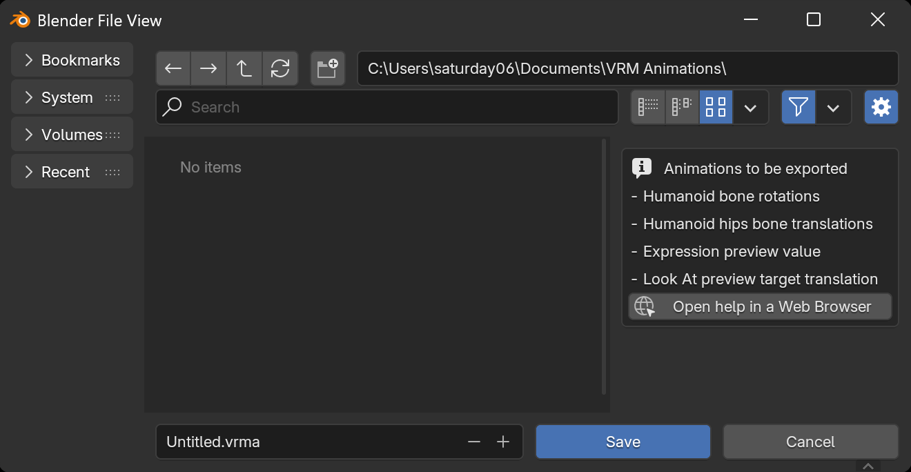

By selecting `File` → `Export` → `VRM Animation (.vrma)` from the menu, the
[VRM Animation](../../animation/) export dialog will be displayed.

When you press the `Save` button, animations assigned to VRM 1.0 placed in the
scene that meet the following conditions will be exported as a VRMA file:

- Rotation values of bones assigned to VRM Humanoid bones
- Translation values of bones assigned to the Hips bone among VRM Humanoid bones
- Preview values of VRM Expressions
- Translation values of objects specified in the Preview Target of VRM Look At
