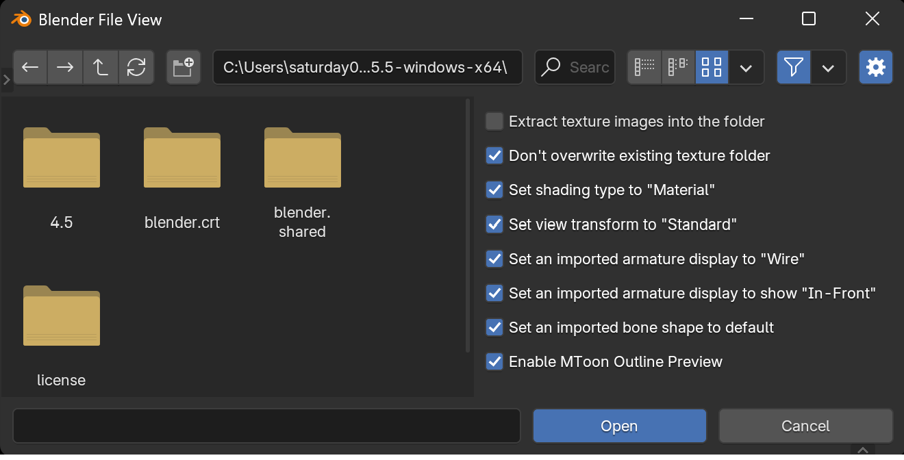

Select `File` → `Import` → `VRM (.vrm)` from the menu to display the VRM import
dialog. Select a VRM file and click the `Open` button to load the VRM file into
the scene.

### Options

#### ✅ Extract texture images into the folder

Creates a folder in the same location as the VRM file and extracts the textures
contained within the VRM file. If unchecked, textures will be embedded in the
currently edited `.blend` file.

#### ✅ Don't overwrite existing texture folder

When creating a folder for texture images, if a folder already exists, a
sequential number will be appended to prevent overwriting the folder.

#### ✅ Set shading type to "Material"

After loading the VRM file, sets the 3D viewport shading to Material Preview.
While this setting may not be particularly meaningful for users familiar with
Blender, it's intended to help newcomers get excited by seeing a display that
closely matches how it appears on other platforms immediately after import.

#### ✅ Set view transform to "Standard"

After loading the VRM file, sets the color management view transform to
"Standard". VRM files are not compatible with Blender's default view transform
settings and often appear slightly dull. Setting the view transform to
"Standard" solves this issue.

#### ✅ Set an imported armature display to "Wire"

After loading the VRM file, sets the armature viewport display to "Wire".

#### ✅ Set an imported armature display to show "In-Front"

After loading the VRM file, displays the armature in front of other objects.

#### ✅ Set an imported bone shape to default

The official importer for the glTF format, which is the parent specification of
VRM, sometimes automatically changes the bone shape display to ICO spheres or
similar. However, as the addon author, I find this behavior unnatural for VRM
files that primarily contain humanoid armatures. This option suppresses that
behavior and sets bones to the default octahedral shape.

#### ✅ Enable MToon Outline Preview

"MToon", the toon shader included in VRM, includes an anime-style outline
rendering feature. Since this is implemented using the inverted hull method,
enabling it may increase the vertex count displayed in the statistics overlay
and increase viewport performance load. Disabling this option resolves these
issues.
