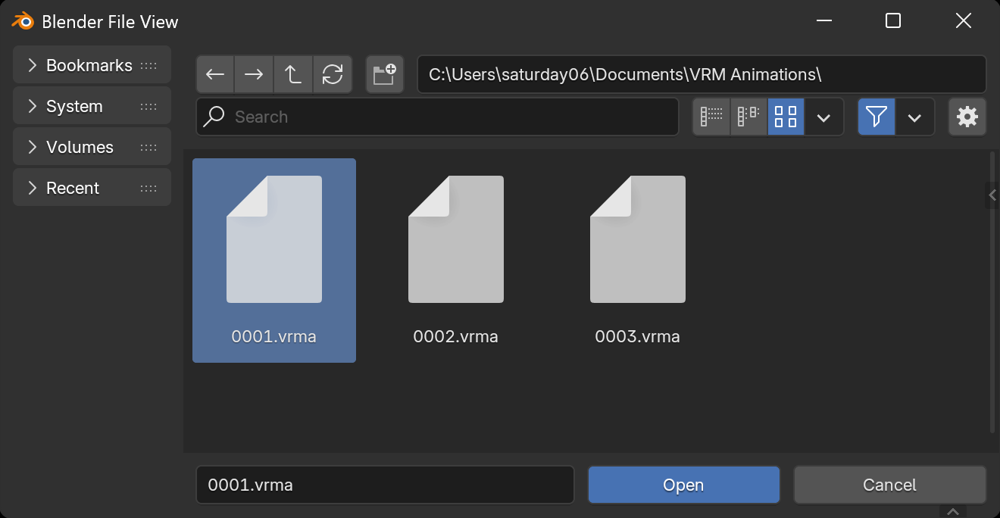

By selecting `File` → `Import` → `VRM Animation (.vrma)` from the menu, the
[VRM Animation](../../animation/) import dialog will be displayed.

When you select a VRMA file and press the `Open` button, the animation will be
applied to the VRM 1.0 model in the current scene. If there is no VRM 1.0 model
in the current scene, a minimal model will be automatically generated.
