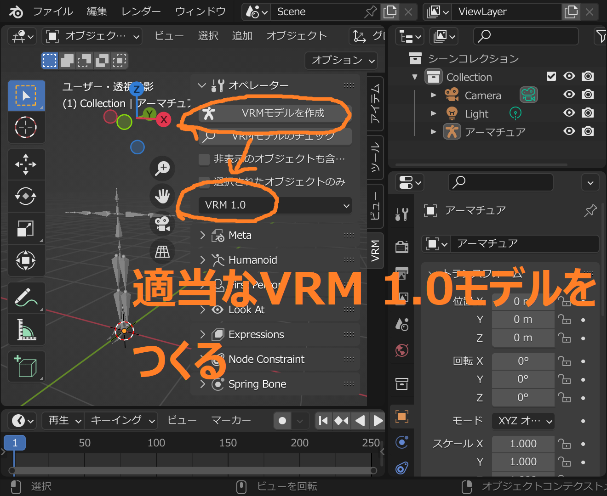
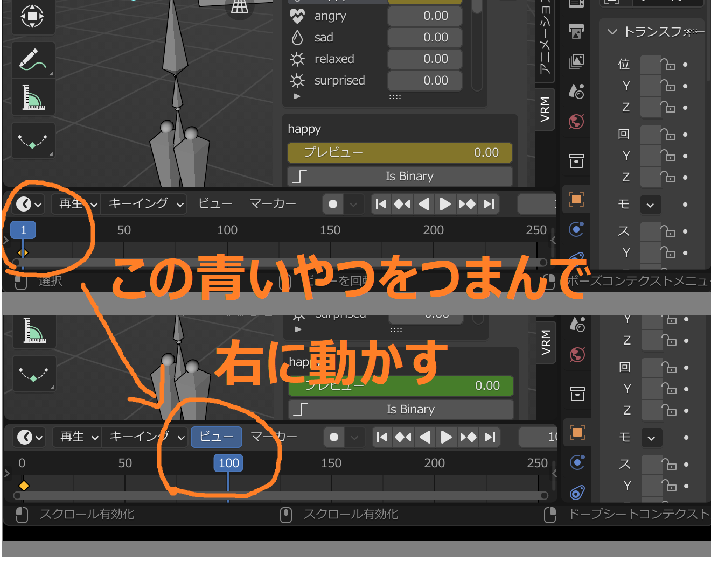
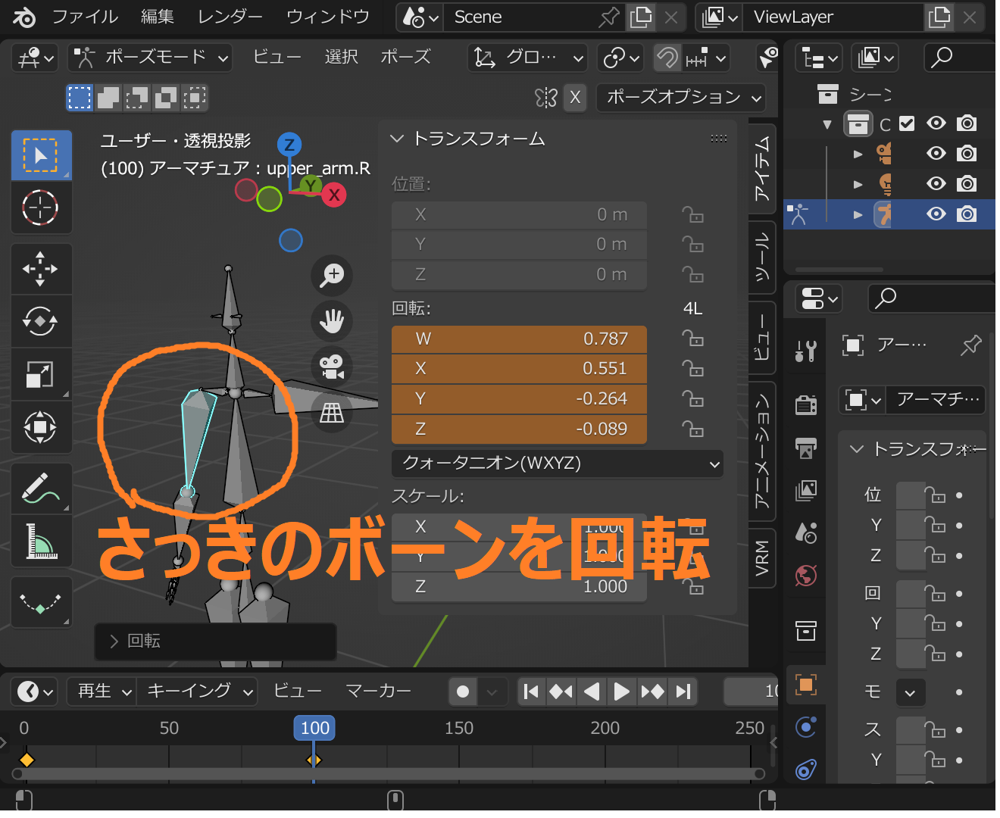

VRM Animationのインポートとエクスポートの解説です。

## VRM Animationファイルのエクスポート

VRM Animationのエクスポートには、VRM
1.0のアーマチュアが必要です。エクスポートされるアニメーションは次の通りです

- Humanoidボーンの回転値
- Humanoid Hipsボーンの移動値
- Expressionのプレビュー値 (Look At値のエクスポートは現在未対応)

最低限のアニメーションをエクスポートしてみます。

## VRM Animationファイルのインポート

