このチュートリアルでは、VRM Add-on for Blenderのインストール手順を解説します。

Blenderのバージョンやダウンロード元にあわせて手順が変わります。次の3種類の方式から選択してください。
{#installation-methods}

- [Blender 4.2以上で、Blenderの設定画面からダウンロードする場合](#installation-4.2-or-later-online)
- [Blender 4.2以上で、Webブラウザからダウンロードする場合](#installation-4.2-or-later-offline)
- [Blender 2.93から4.1の場合](#installation-2.93-to-4.1)

## Blender 4.2以上で、Blenderの設定画面からダウンロードする場合 <a id="installation-4.2-or-later-online"/> {#installation-4.2-or-later-online}

Blender
4.2以降では、Blenderの設定画面からダウンロードとインストールを行うことができます。また、アドオンのアップデートが公開された場合、設定画面でボタンを押すだけでアップデートが実行できるようになります。

まずはBlenderを起動し、メニューの `編集` → `プリファレンス` を選択します。

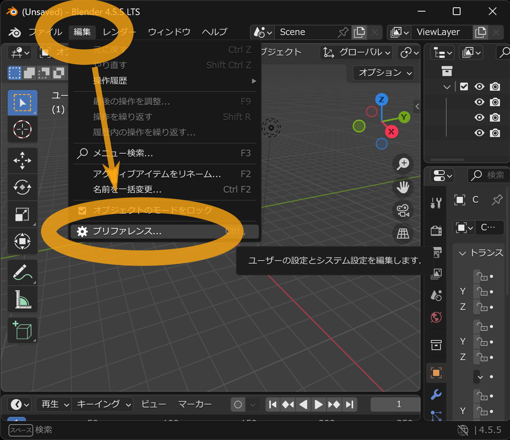

設定画面が出るので、左メニューの `エクステンションを入手` を選択します。

ここでもし「オンラインエクステンションのインストールや更新はインターネットアクセスが必要です。」
という趣旨のメッセージが表示されたら `オンラインアクセスを許可`
ボタンを押してください。

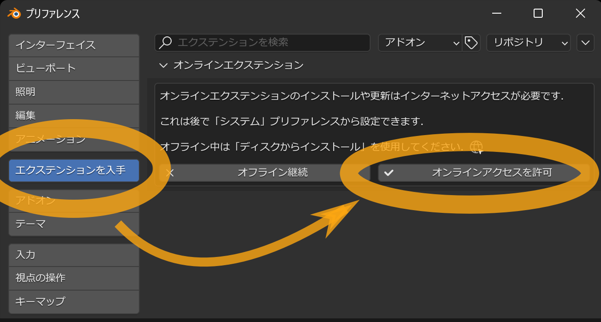

> [!TIP]
> 「オンラインアクセスを許可」ボタンを押すと、Blenderがインターネットとの通信を行うことができるようになります。
> もしそれを行いたくない場合は、[Blender 4.2以降をご利用かつ、Webブラウザからダウンロードする場合](#installation-4.2-or-later-offline)の手順でインストールしてください。

しばらくすると「利用可能」一覧が表示されるので「VRM
format」の項目を探してください。項目が多すぎて探すのが大変な場合は、上側にある検索ボックスに
`VRM` と入力すると絞り込み検索ができます。

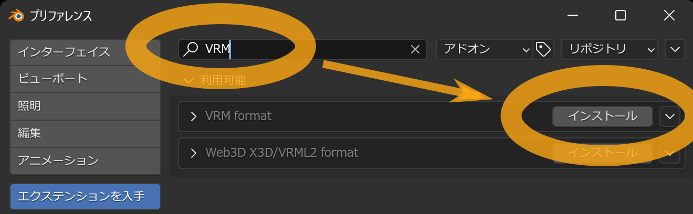

「インストール」ボタンを押すことで、インストールが完了します。

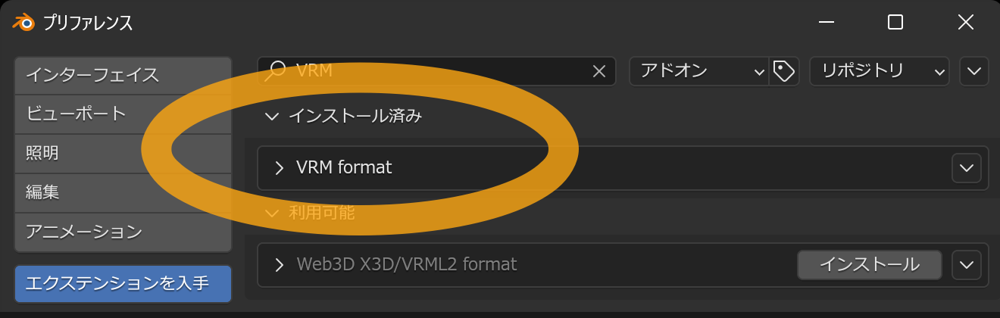

もし一覧に何も出ない場合、オンラインアクセスの許可設定が無効になっている可能性があります。設定画面の
`システム` を選び `オンラインアクセスを許可` のチェックボックスをONにし、
もう一度 `エクステンションを入手` を選択してください。

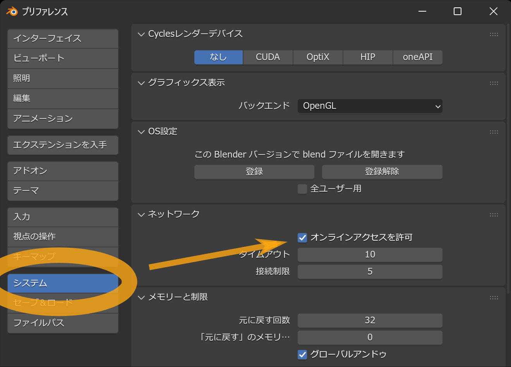

それでも一覧に何も出ない場合は、インターネットアクセスを確認してください。また、Blenderのオンラインサービスが止まっている可能性もあります。
https://status.blender.org/status/public から、 稼働状況を確認できます。

## Blender 4.2以上で、Webブラウザからダウンロードする場合 <a id="installation-4.2-or-later-offline"/> {#installation-4.2-or-later-offline}

Blenderのオンラインアクセスを不許可にしたままにしたい場合は、Webブラウザからアドオンファイルをダウンロードし、それを設定画面から追加する方式になります。
まずは[Blender Extensions Platform](https://extensions.blender.org/add-ons/vrm/)を開いてください。

`Get Add-on` のボタンを押します。

`download`
リンクが出現するため、それを押すことでアドオンファイルがダウンロードされます。

> [!TIP]
> ダウンロードしたアドオンファイルはzipファイルになっていますが、<u>展開せずそのまま</u>利用します。これは、もし展開した場合、展開されたデータはアドオンとして機能しないためです。

> [!INFO]
> Webサイト上に表示されている `Drag and Drop into Blender`
> という指示に従うことでもインストールはできますが、その場合はBlenderのオンラインアクセスを許可する必要があります。

次にBlenderを起動し、メニューの `編集` → `プリファレンス` を選択します。

設定画面が出るので、左メニューの `アドオン` を選択後、右上の `˅`
ボタンを押し、表示されるメニューの `ディスクからインストール` を選択します。
ボタンを押します。

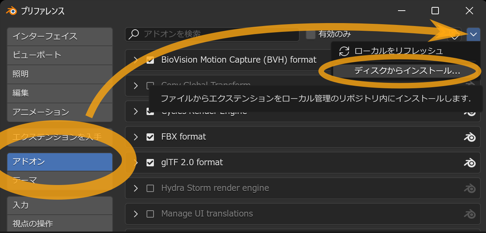

ファイルを開くウィンドウが表示されるため、先ほどダウンロードしたアドオンファイルを選択し、ファイル名の末尾が
`.zip` になっていることを確認してから `ディスクからインストール`
ボタンを押します。

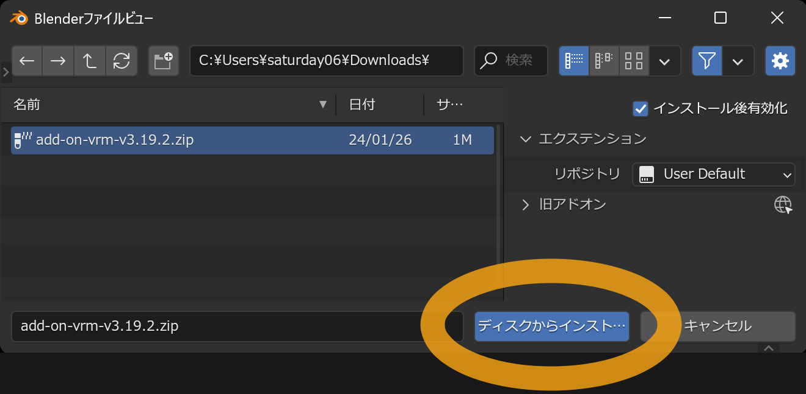

`VRM format`
という項目が一覧に追加され、チェックボックスがONになっていればインストール完了です。

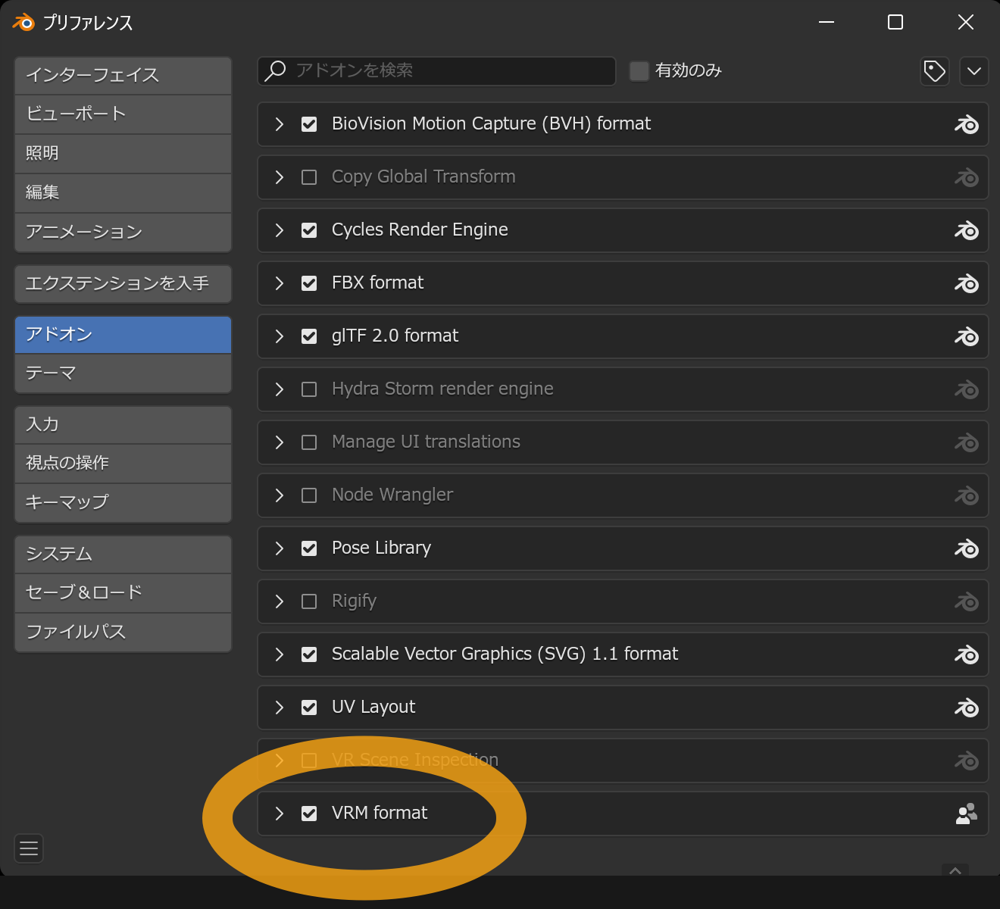

もしチェックボックスがOFFになっている場合、手動でONにしてください。

`VRM format` という項目が一覧に追加されない場合は、次について確認してください。

- ダウンロードしたアドオンファイルはzipファイルですが、<u>展開せずそのまま</u>にしていること
- 選択したアドオンファイル名の末尾が `.zip` になっていること

## Blender 2.93から4.1をご利用の方 <a id="installation-2.93-to-4.1"/> {#installation-2.93-to-4.1}

はじめに <DownloadLinkJa /> から最新版のアドオンファイルをダウンロードします。

> [!TIP]
> ダウンロードしたアドオンファイルはzipファイルになっていますが、<u>展開せずそのまま</u>利用します。これは、もし展開した場合、展開されたデータはアドオンとして機能しないためです。

次にBlenderを起動し、メニューの `編集` → `プリファレンス` を選択します。

設定画面が出るので、左メニューの `アドオン` を選択後、右上の `インストール`
ボタンを押します。

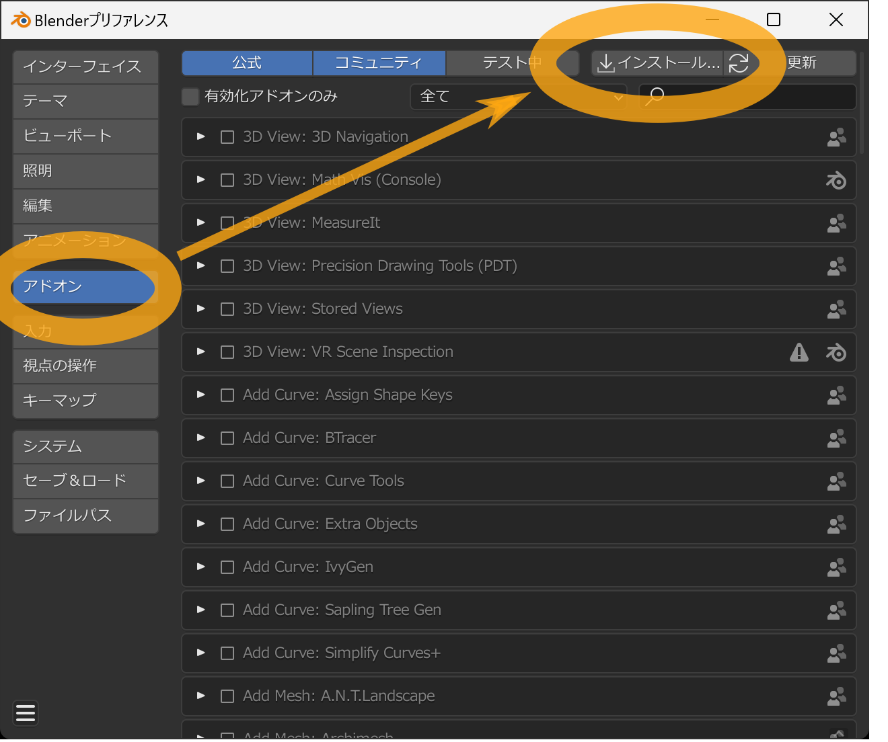

ファイルを開くウィンドウが表示されるため、先ほどダウンロードしたアドオンファイルを選択し、ファイル名の末尾が
`.zip` になっていることを確認してから `アドオンをインストール`
ボタンを押します。

`コミュニティ` が有効になっていることを確認してください。

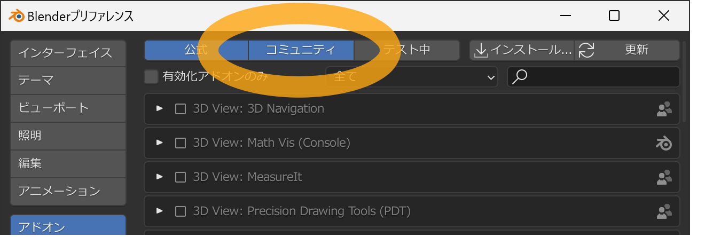

次にアドオン一覧表示から `Import-Export: VRM format` を探します。

表示項目が多くて探すのが大変な場合は右上に検索ボックスがあるので、そこに `VRM`
と入力すると項目の絞り込みができます。

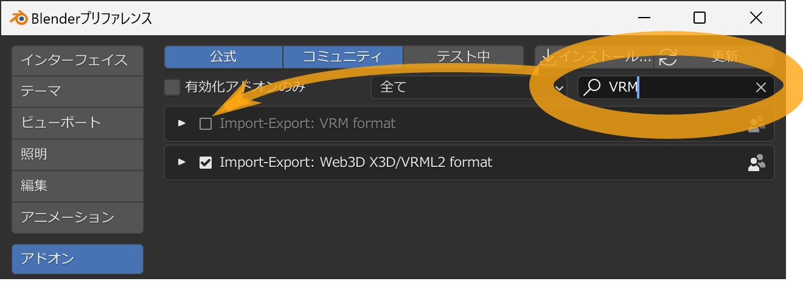

探しても見つからない場合は、次について確認してください。

- ダウンロードしたアドオンファイルはzipファイルですが、<u>展開せずそのまま</u>にしていること
- 選択したアドオンファイル名の末尾が `.zip` になっていること
- ウィンドウ上部の `コミュニティ` が有効になっていること

チェックボックスを押すことでアドオンのインストールが完了します。

