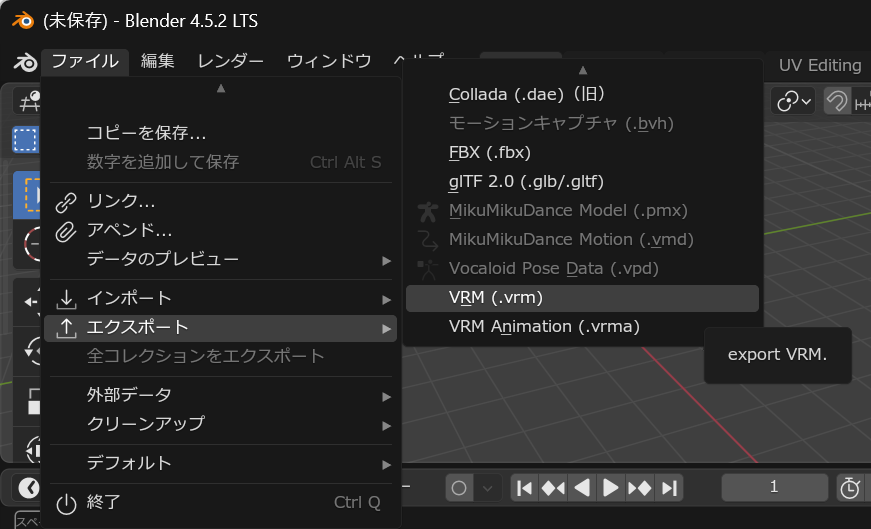

メニューの `ファイル` → `エクスポート` → `VRM(.vrm)`
を選択することで、VRMのエクスポートダイアログが表示されます。 `保存`
ボタンを押すと、現在編集中のアーマチュアがVRMファイルとしてエクスポートされます。

#### ✅ 非表示のオブジェクトを含める

エクスポート時に非表示のオブジェクトを含めます。例外的に、エクスポート対象のアーマチュアだけは非表示でもエクスポートします。

#### ✅ 選択されたオブジェクトのみ

選択中のオブジェクトのみエクスポートします。

#### ✅ 高度なオプションを有効にする

【高度なオプション】の項目を有効にします。これらの項目を変更すると、VRMファイルのアプリケーション間の互換性が失われることがあるので注意してください。

#### ✅ 【高度なオプション】【VRM 1.0のみ】スパースアクセッサを利用する

シェイプキーのエクスポート時にスパースアクセッサを利用します。
シェイプキーを利用しているモデルでファイルサイズが削減される可能性がありますが、
[UniVRM 0.115.0以下](https://github.com/saturday06/VRM-Addon-for-Blender/issues/381#issuecomment-1838365762)を利用している古いアプリでVRMファイルが読めなくなります。

#### ✅ 【高度なオプション】【VRM 1.0のみ】全てのボーンウェイトをエクスポートする

全てのボーンウェイトをエクスポートします。VRMは仕様上は、
1つの頂点に対して255個までのボーンウェイトを割り当てることができます。
しかし、ほとんどのVRMを扱うアプリケーションは、1つの頂点にあたり4つのウェイトまでしか解釈しません。
そのため、デフォルトでは表示互換性のためエクスポートするウェイトは4つまでに制限しています。
この制限を外し、すべてのボーンウェイトをエクスポートするようにします。
アプリケーションによってメッシュが大きく崩れることがあるため、慎重にウェイトを設定するか、エクスポート結果を特定の
アプリケーションのみで利用する場合にご利用ください。

#### ✅ 【高度なオプション】【VRM 1.0のみ】ライトをエクスポートする

ライトオブジェクトをエクスポート対象に含めます。VRMにおけるライトの扱いは現在コンセンサスが無く、
どのような結果になるかが予測できません。ライトを扱えるアプリケーションのみで利用する場合にご利用ください。

#### ✅ 【高度なオプション】【VRM 1.0のみ】glTFアニメーションをエクスポートする

glTFアニメーションをエクスポート結果に含めます。
VRMファイルはモーションのリターゲッティングをすることが前提のフォーマットのため、
そのままglTFのアニメーションがそのまま適用できないことが多いため、デフォルトではエクスポートしません。
代わりに [VRM Animation](https://vrm-addon-for-blender.info/ja-jp/animation/)
の利用を検討してください。
