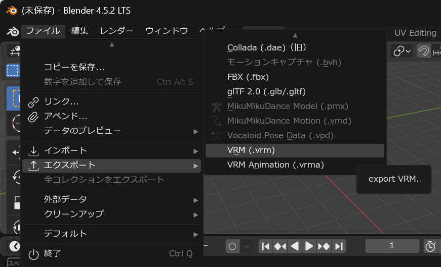

現在のアーマチュアを、VRMファイルとしてエクスポートします。

#### ✅ 非表示のオブジェクトを含める

エクスポート時に非表示のオブジェクトを含めます。例外的に、エクスポート対象のアーマチュアだけは非表示でもエクスポートします。

#### ✅ 選択されたオブジェクトのみ

選択中のオブジェクトのみエクスポートします。

#### ✅ 高度なオプションを有効にする

【高度なオプション】の項目を有効にします。これらの項目を変更すると、VRMファイルの互換性が失われることがあるので注意してください。

#### ✅ 【高度なオプション】スパースアクセッサを利用する

シェイプキーのエクスポート時にスパースアクセッサを利用します。これにより、ファイルサイズが削減される可能性がありますが、一部のプラットフォームで読めなくなります。

#### ✅ 【高度なオプション】全てのボーンウェイトをエクスポートする

全てのボーンウェイトをエクスポートします。これは

#### ✅ 【高度なオプション】ライトをエクスポートする

#### ✅ 【高度なオプション】glTFアニメーションをエクスポートする
