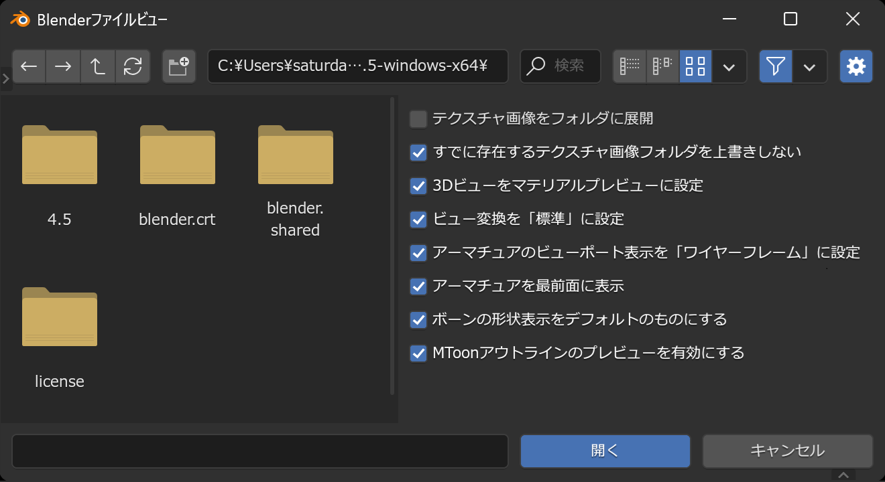

メニューの `ファイル` → `インポート` → `VRM (.vrm)`
を選択することで、VRMのインポートダイアログが表示されます。VRMファイルを選択して
`開く` ボタンを押すとシーンにVRMファイルが展開されます。

## オプション

### ✅ テクスチャ画像をフォルダに展開

VRMファイルの配置場所と同じ場所にフォルダを作成し、VRMファイル内に存在するテクスチャを展開します。
チェックをしない場合、テクスチャは現在編集中の `.blend`
ファイル内に埋め込まれます。

### ✅ すでに存在するテクスチャ画像フォルダを上書きしない

テクスチャ画像用のフォルダ作成時に、既にフォルダが存在している場合は連番を付与し、
フォルダの上書きが発生しないようにします。

### ✅ 3Dビューをマテリアルプレビューに設定

VRMファイルの読み込み後、3Dビューポートのシェーディング設定をマテリアルプレビューに設定します。
こちら、Blenderに慣れている人にとってはあまり意味のない設定ではありますが、
まだ慣れていない人がインポート直後に、別プラットフォームでの表示とほぼ同じ表示を再現することによって、
テンションを上げて欲しいという思いがあります。

### ✅ ビュー変換を「標準」に設定

VRMファイルの読み込み後、カラーマネージメントのビュー変換を「標準」に設定します。
VRMファイルはBlenderのデフォルトのビュー変換設定と相性が悪く、若干くすんだ表示になることが多いです。
ビュー変換を「標準」にすることで、この問題を解決します。

### ✅ アーマチュアのビューポート表示を「ワイヤーフレーム」に設定

VRMファイルの読み込み後、アーマチュアのビューポート表示を「ワイヤーフレーム」に設定します。

### ✅ アーマチュアを最前面に表示

VRMファイルの読み込み後、アーマチュアを最前面に表示します。

### ✅ ボーンの形状表示をデフォルトのものにする

VRMの親仕様であるglTF形式の公式インポーターは、ボーンの形状表示をICO球などに自動で変更することがあります。
しかし、アドオン作者としては、主に人型のアーマチュアが展開されるVRMファイルに対してはこの動作は不自然に感じています。
これを抑制し、デフォルトの角錐に設定します。

### ✅ MToonアウトラインのプレビューを有効にする

VRMに含まれるトゥーンシェーダーである「MToon」は、アニメ風のアウトラインの描画機能を含みます。
こちらは背面法により実装されているため、有効にすると統計オーバーレイに表示される頂点数が増えたり、
ビューポートの動作負荷が高まることがあります。無効にすることで、これらの問題を解決できます。
