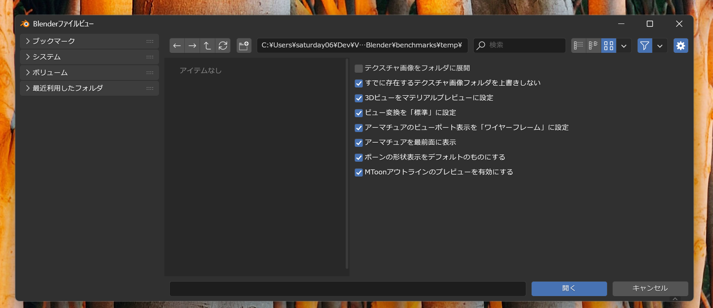

VRMファイルを開き、現在のシーンに展開します。メニューの「ファイル」→「インポート」→「VRM (.vrm)」を選択します。

#### ✅ テクスチャ画像をフォルダに展開

VRMファイルの配置場所と同じ場所にフォルダを作成し、VRMファイル内に存在するテクスチャを展開します。

#### ✅ すでに存在するテクスチャ画像フォルダを上書きしない

テクスチャ画像用のフォルダ作成時に、既にフォルダが存在している場合は連番を付与し、フォルダの上書きが発生しないようにします。

#### ✅ 3Dビューをマテリアルプレビューに設定

VRMファイルの読み込み後、3Dビューポートのシェーディング設定をマテリアルプレビューに設定します。
こちら、Blenderに慣れている人にとってはあまり意味のない設定になります。慣れていない人向けに、
インポート直後に、別プラットフォームでの表示とほぼ同じ表示を再現することによって、
テンションを上げて欲しいという願いがあります。

#### ✅ ビュー変換を「標準」に設定

VRMファイルの読み込み後、カラーマネージメントのビュー変換を「標準」に設定します。
VRMファイルはBlenderのデフォルトのビュー変換設定と相性が悪く、若干くすんだ表示になることが多いです。
ビュー変換を「標準」にすることで、この問題を解決します。

#### ✅ アーマチュアのビューポート表示を「ワイヤーフレーム」に設定

VRMファイルの読み込み後、アーマチュアのビューポート表示を「ワイヤーフレーム」に設定します。

#### ✅ アーマチュアを最前面に表示

VRMファイルの読み込み後、アーマチュアを最前面に表示します。

#### ✅ ボーンの形状表示をデフォルトのものにする

VRMの親仕様であるglTF形式の公式インポーターは、ボーンの形状表示をICO球などに自動で変更することがあります。
これを抑制し、デフォルトの角錐に設定します。

#### ✅ MToonアウトラインのプレビューを有効にする

VRMに含まれるトゥーンシェーダーである「MToon」は、アニメ風のアウトラインの描画機能を含みます。
こちらは背面法により実装されているため、有効にすると見た目上の頂点数が増えたりビューポートが重くなったりします。
無効にすることで、これらの問題を解決できます。
