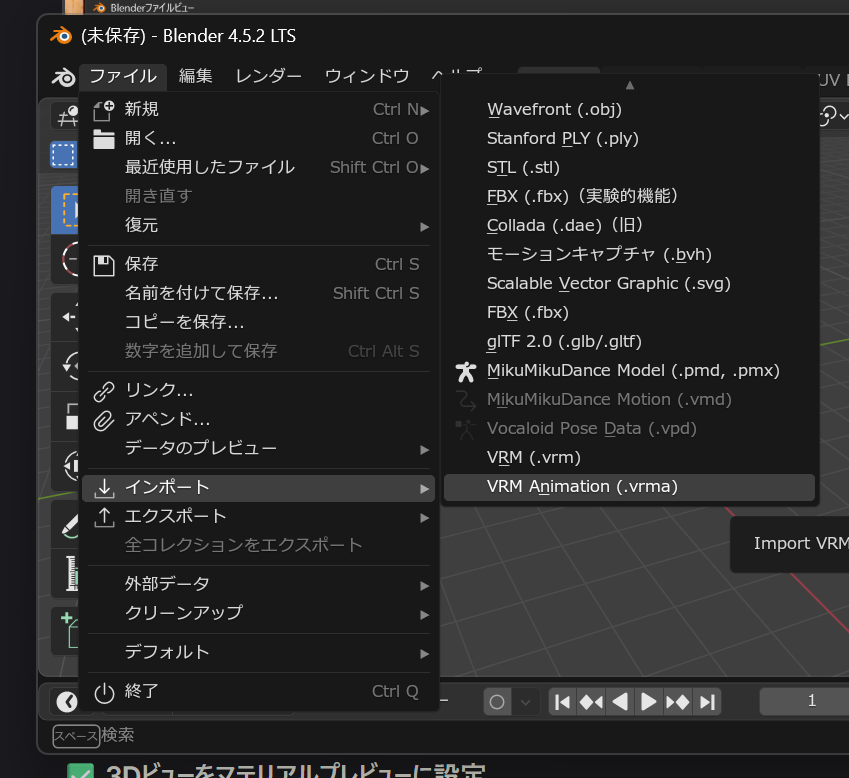

メニューの `ファイル` → `インポート` → `VRM Animation (.vrma)`
を選択することで、 [VRM Animation](../../animation/)
のインポートダイアログが表示されます。

VRMAファイルを選択して `開く` ボタンを押すと、 現在のシーンのVRM
1.0モデルにアニメーションが反映されます。 現在のシーンにVRM
1.0モデルが存在しない場合、最小のモデルを自動生成します。
