シンプルな人型のVRMモデルを作ります。

Blenderを起動したら、3Dビューポートにマウスカーソルを置き、 `n`
キーを押してください。

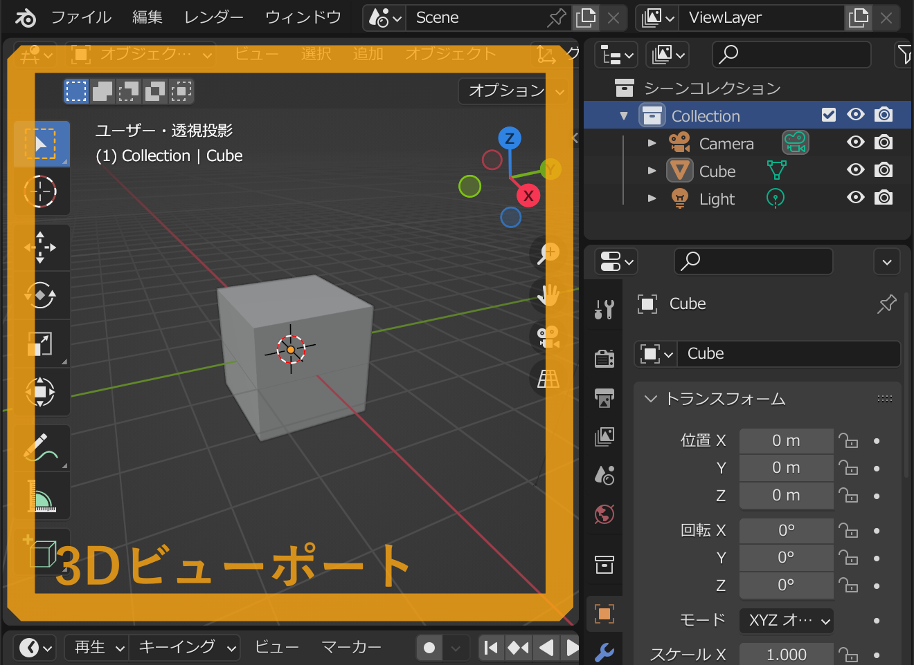

すると右側からサイドバーが開くので `VRM` のタブを選択し `VRMモデルを作成`
ボタンを押してください。

するとVRM出力に適したアーマチュアが自動で作られます。アーマチュアとは3Dモデルのボーンの構造を
表すデータで、このアドオンではVRMの人型の骨格を表すためにアーマチュアを使います。

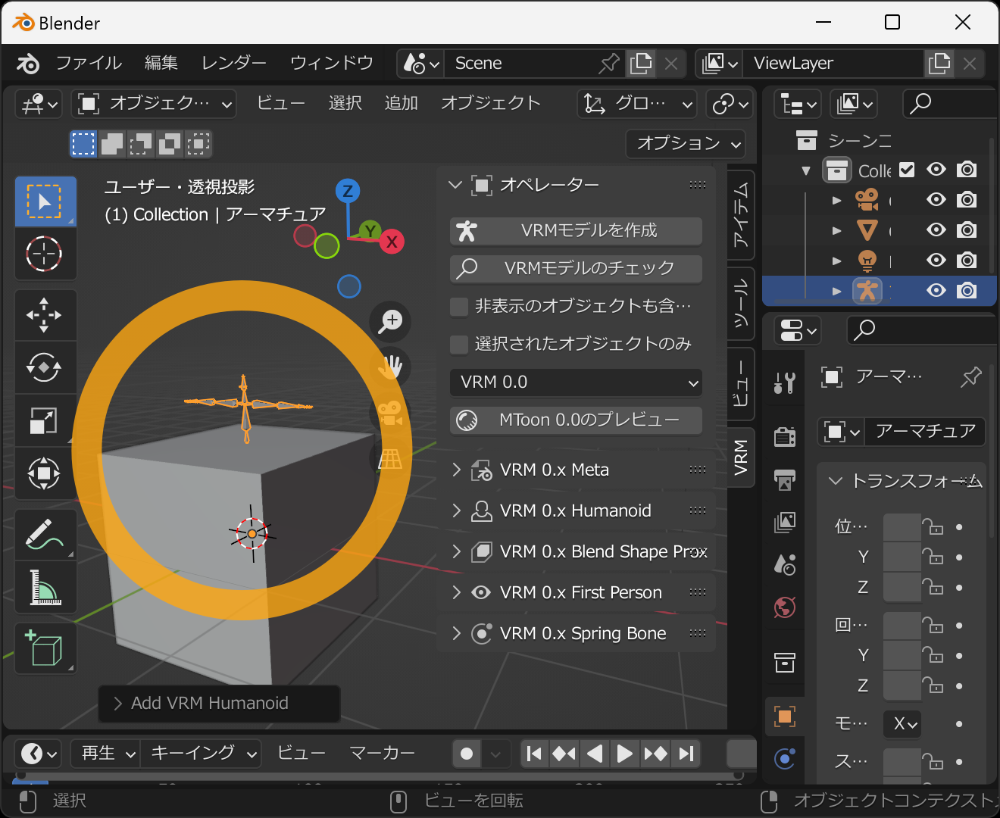

デフォルトで置いてある立方体を胴体にします。ただこのままでは胴体とするには大きすぎるので小さくします。
まずは3Dビューポートで立方体を選択します。次に右下の「」アイコンのタブを選び
`トランスフォーム` から `スケール` の値を全て `0.2`
にします。これで胴体として使えそうな大きさになります。

胴体をアーマチュアのボーンに関連付けます。`関係` から `ペアレント` を
`アーマチュア` または `Armature` にし、 `親タイプ` を`ボーン` とし、`親ボーン`
を `spine` に設定してください。胴体が3Dモデルの腰あたりに移動します。

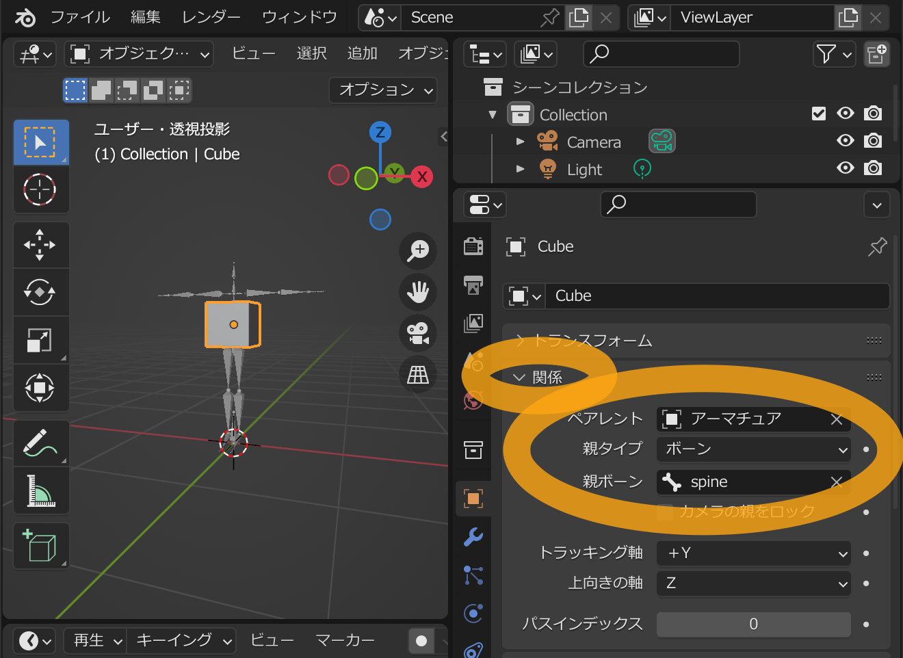

次は頭を作ります。3Dビューポート内にカーソルを置いた状態で、キーボードの `Shift`
キーを押したまま `a`
キーを押してください。するとオブジェクトの追加メニューが表示されるため
`メッシュ` → `UV球` を選択してください。

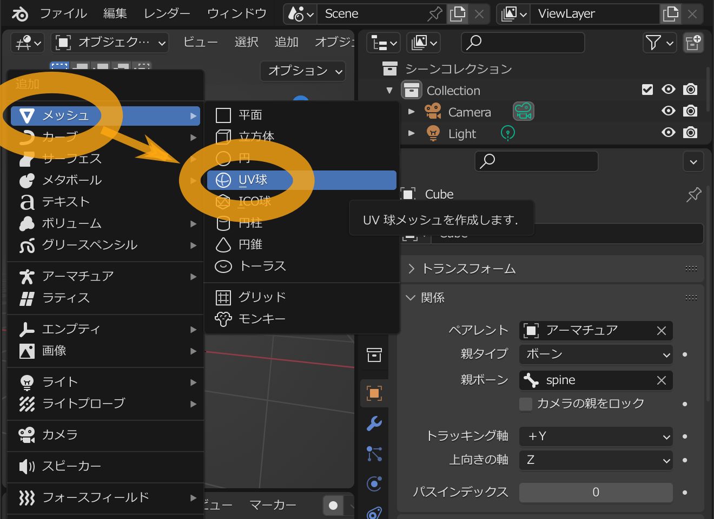

`球` あるいは `Sphere` が追加されます。

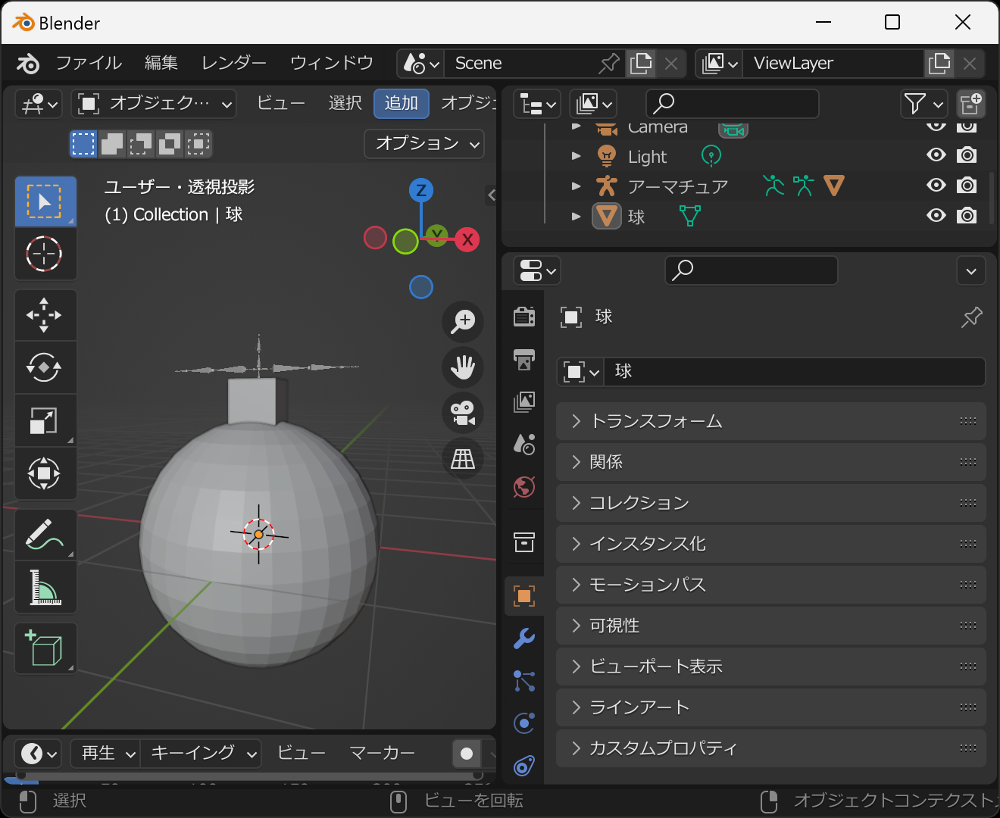

これを頭として使いたいのですが、大きすぎるので縮小します。追加された球を選択し、右下の「」アイコンのタブを選び`トランスフォーム`
から `スケール` の値を全て `0.25` にします。

この球をアーマチュアのボーンに関連付けます。`関係` から `ペアレント` を
`アーマチュア` または `Armature` にし、 `親タイプ` を`ボーン` とし、 `親ボーン`
を `head` に設定してください。球が3Dモデルの頭あたりに移動します。

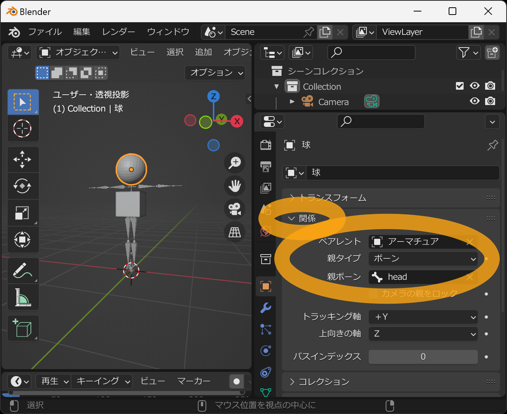

次は手足を追加します。3Dビューポート内にカーソルを置いた状態で、キーボードの
`Shift` キーを押したまま `a`
キーを押してください。するとオブジェクトの追加メニューが表示されるため
`メッシュ` → `ICO球` を選択してください。

`ICO球` あるいは `Icosphere` が追加されますが、同時に3Dビューポート左下に
`> ICO球を追加` という表示が出ます。こちらをクリックします。

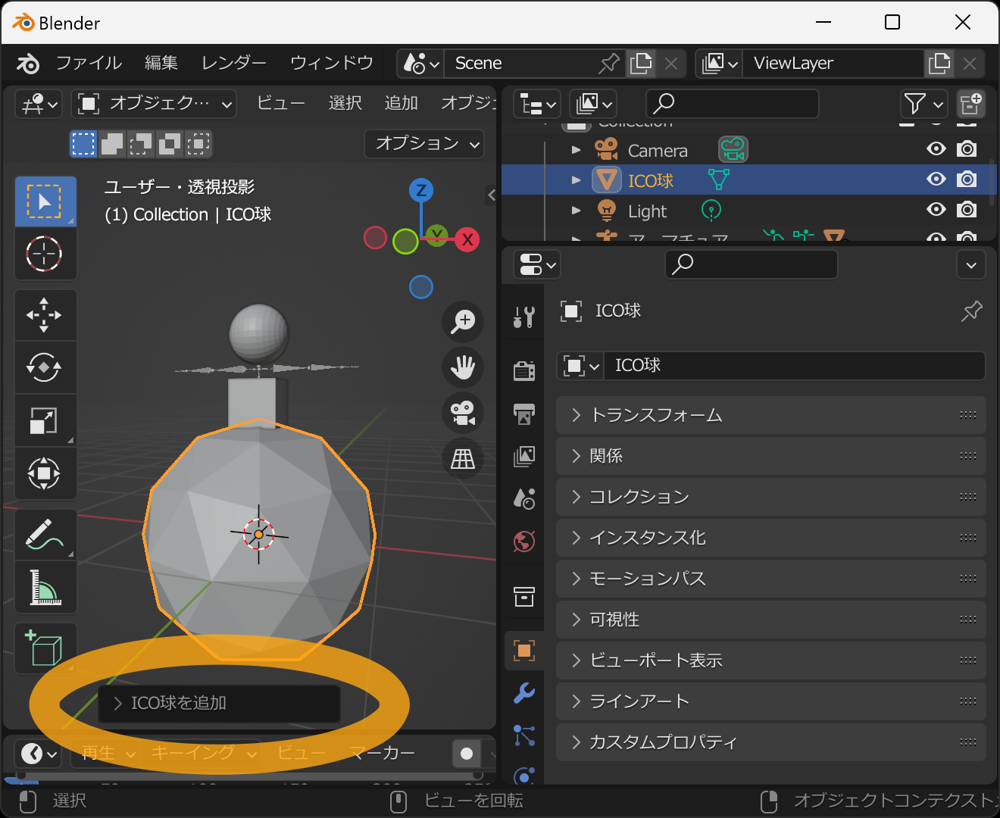

すると、新しく追加するICO球の設定をすることができます。半径が大きすぎると感じたので、半径の値を
`0.1 m` に変更します。

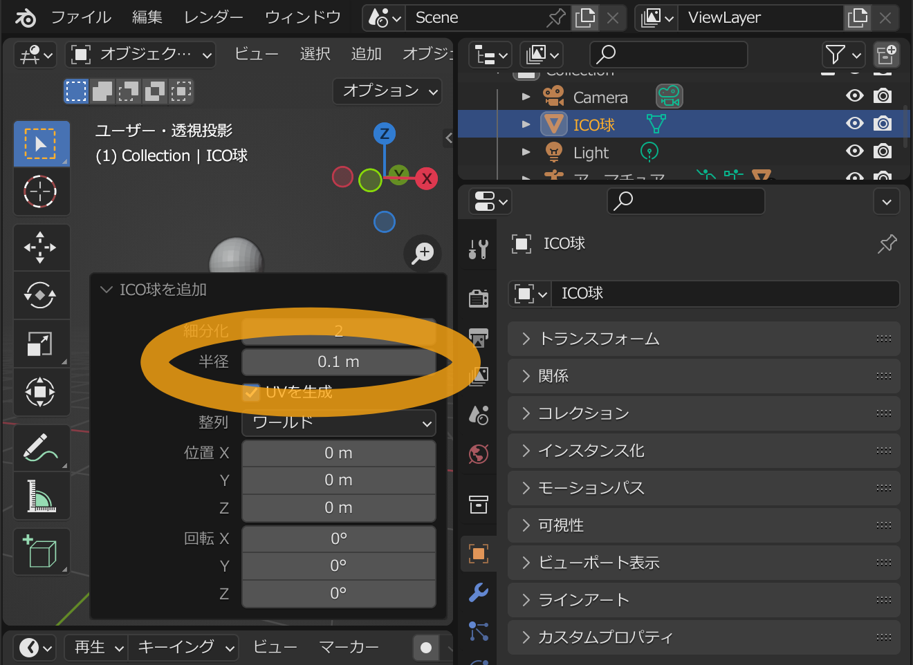

ICO球をアーマチュアの左手上腕のボーンに関連付けます。ICO球を選択し、右下の「」アイコンのタブを選び、
`関係` から `ペアレント` を `アーマチュア` または `Armature` にし、`親タイプ`を
`ボーン` とし、`親ボーン` を `upper_arm.L`
に設定してください。ICO球が3Dモデルの左ひじあたりに移動します。

先ほどと同様にICO球を追加し、次は `hand.L`
ボーンに関連付けます。左手あたりにICO球が配置されます。

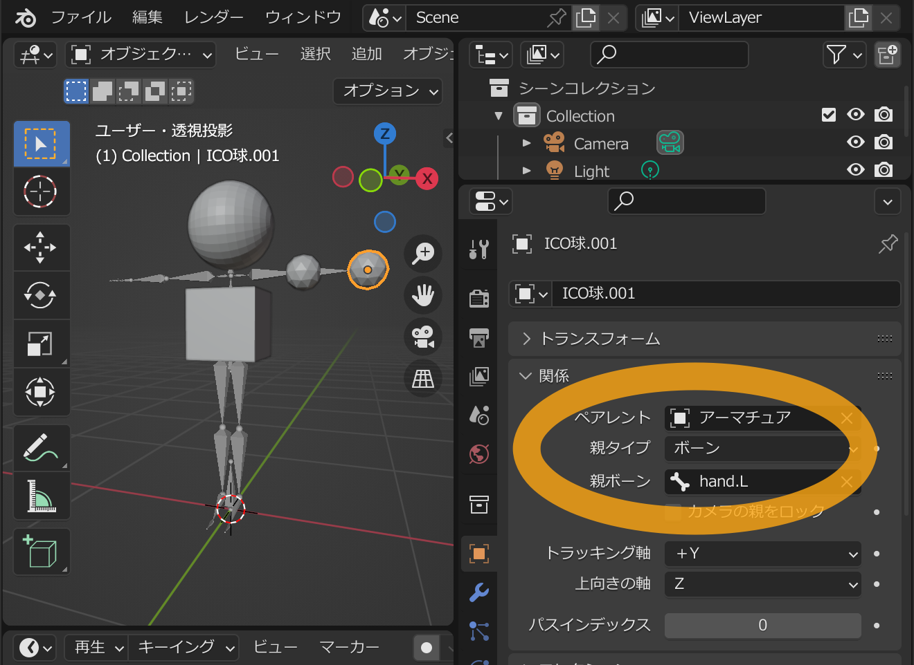

同様に、今度は `upper_arm.R` ボーンに関連付けます。

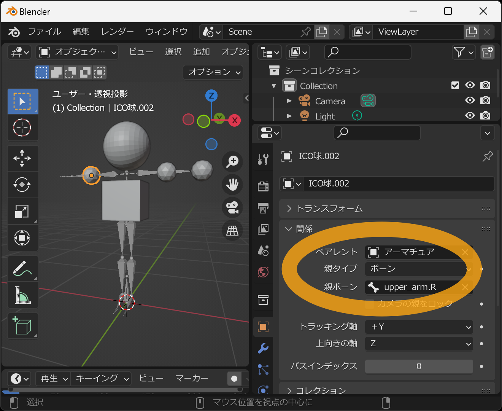

同様に `hand.R` ボーンに関連付けます。

同様に `upper_leg.L` ボーンに関連付けます。

同様に `lower_leg.L` ボーンに関連付けます。

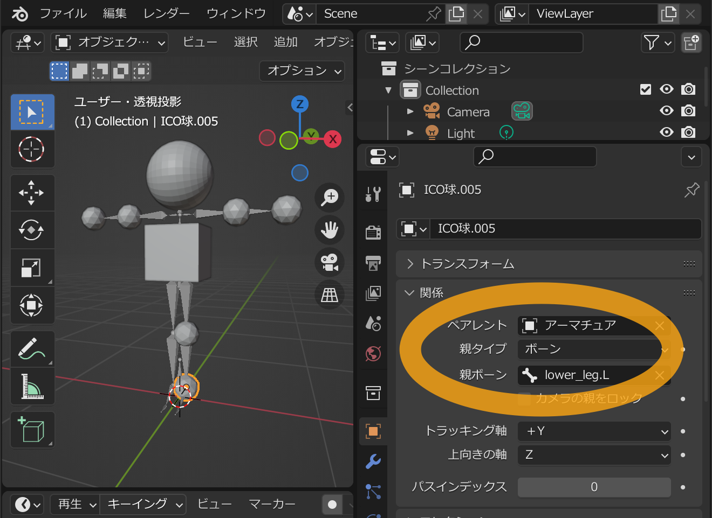

同様に `upper_leg.R` ボーンに関連付けます。

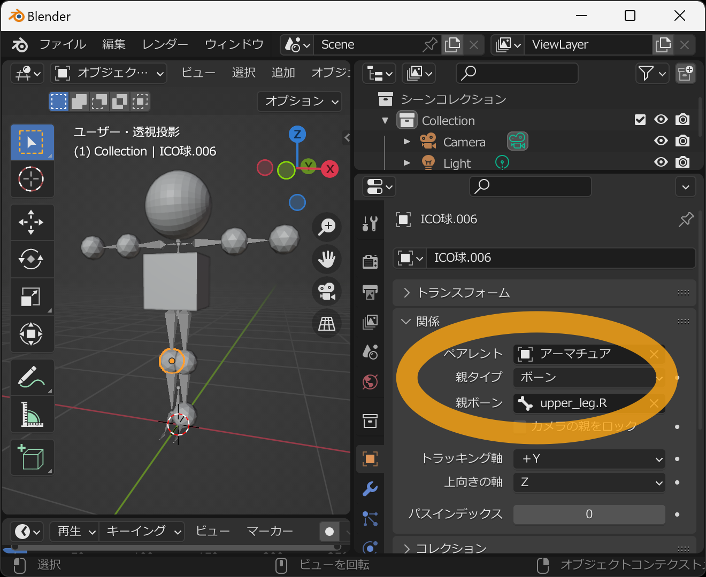

最後に `lower_leg.R` ボーンに関連付けます。

このモデルをVRMとして保存します。メニューの `ファイル` → `エクスポート` →
`VRM (.vrm)` を選択します。

ファイル保存用のウィンドウが出るので、ファイル名と保存先を入力し `Export VRM`
を押します。

成功するとVRMファイルが指定された場所に保存されます。

こちらのページで動作確認ができます。

- https://hub.vroid.com/characters/6595382014094436897/models/1372267393572384142
