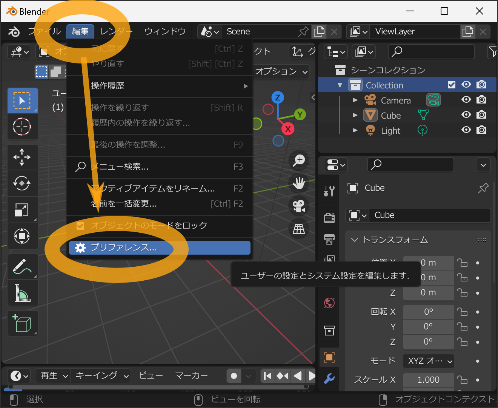
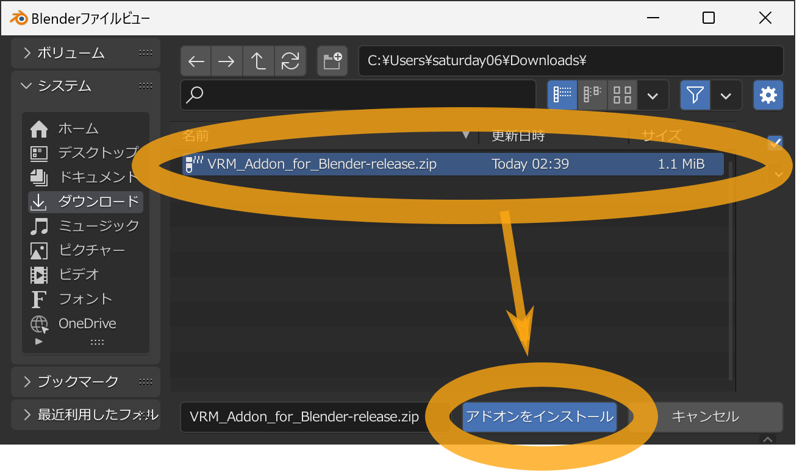
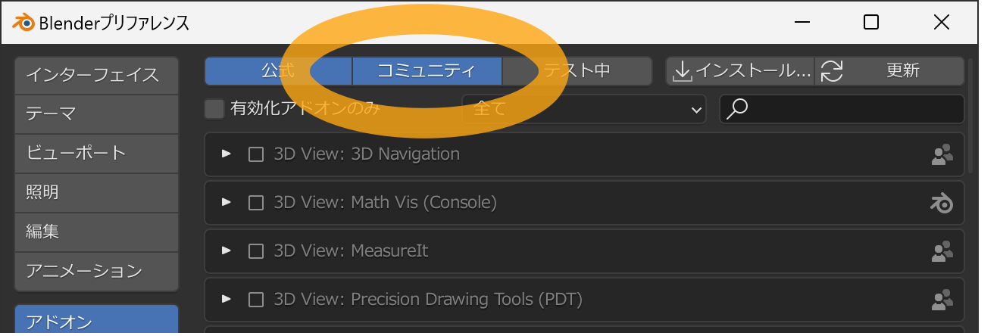
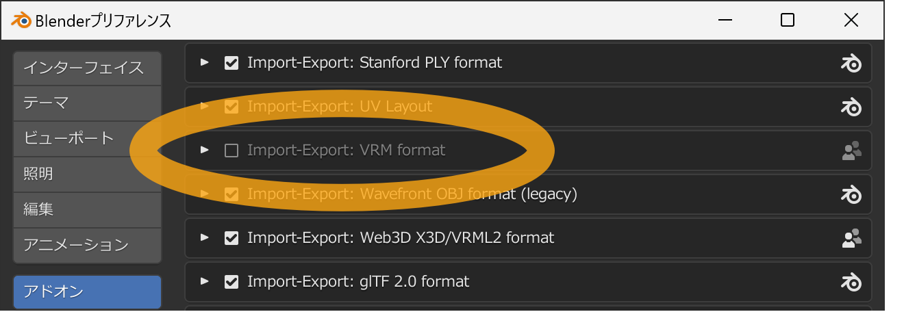
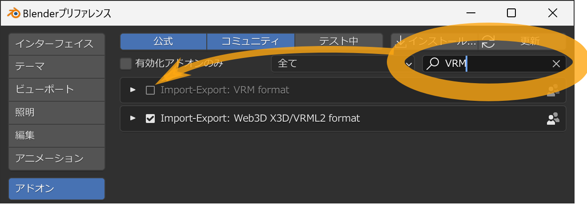
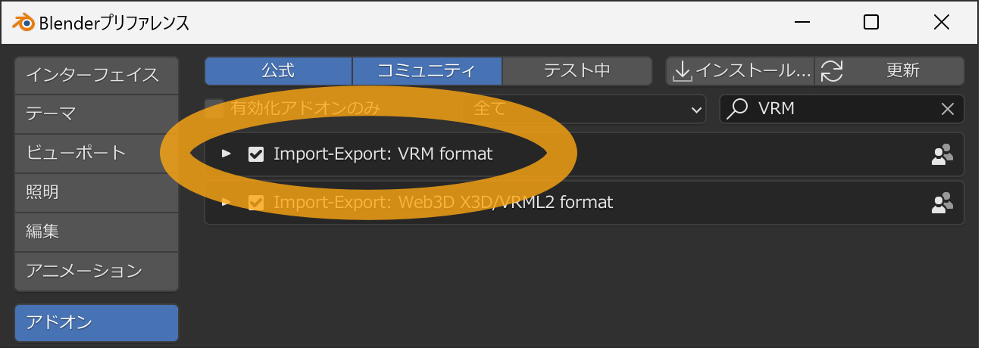

_このチュートリアルは、Blender 2.93から4.1を使う場合のものです。Blender
4.2以降を利用される場合は
[Blender Extension Platform (https://extensions.blender.org/add-ons/vrm)](https://extensions.blender.org/add-ons/vrm)
経由でインストールできます。_

<DownloadLinkJa /> から最新版のアドオンファイルをダウンロードします。

ダウンロードしたアドオンファイルはzipファイルになっていますが、<u>展開せずそのまま</u>利用します。もし展開した場合、展開されたデータはアドオンとして機能しないためです。

次にBlenderを起動し、メニューの `編集` → `プリファレンス` を選択します。

設定画面が出るので、左メニューの `アドオン` を選択後、右上の `インストール`
ボタンを押します。

ファイルを開くウィンドウが表示されるため、先ほどダウンロードしたアドオンファイルを選択し、ファイル名の末尾が
`.zip` になっていることを確認してから `アドオンをインストール`
ボタンを押します。

`コミュニティ` が有効になっていることを確認してください。

次にアドオン一覧表示から `Import-Export: VRM format` を探します。

表示項目が多くて探すのが大変な場合は右上に検索ボックスがあるので、そこに `VRM`
と入力すると項目の絞り込みができます。

探しても見つからない場合は、次について確認してください。

- ダウンロードしたアドオンファイルはzipファイルですが、<u>展開せずそのまま</u>にしていること
- 選択したアドオンファイル名の末尾が `.zip` になっていること
- ウィンドウ上部の `コミュニティ` が有効になっていること

チェックボックスを押すことでアドオンのインストールが完了します。

## 関連リンク

- [トップページ](../)
- [シンプルなVRMモデルを作る](../create-simple-vrm-from-scratch/)
- [人型のVRMモデルを作る](../create-humanoid-vrm-from-scratch/)
