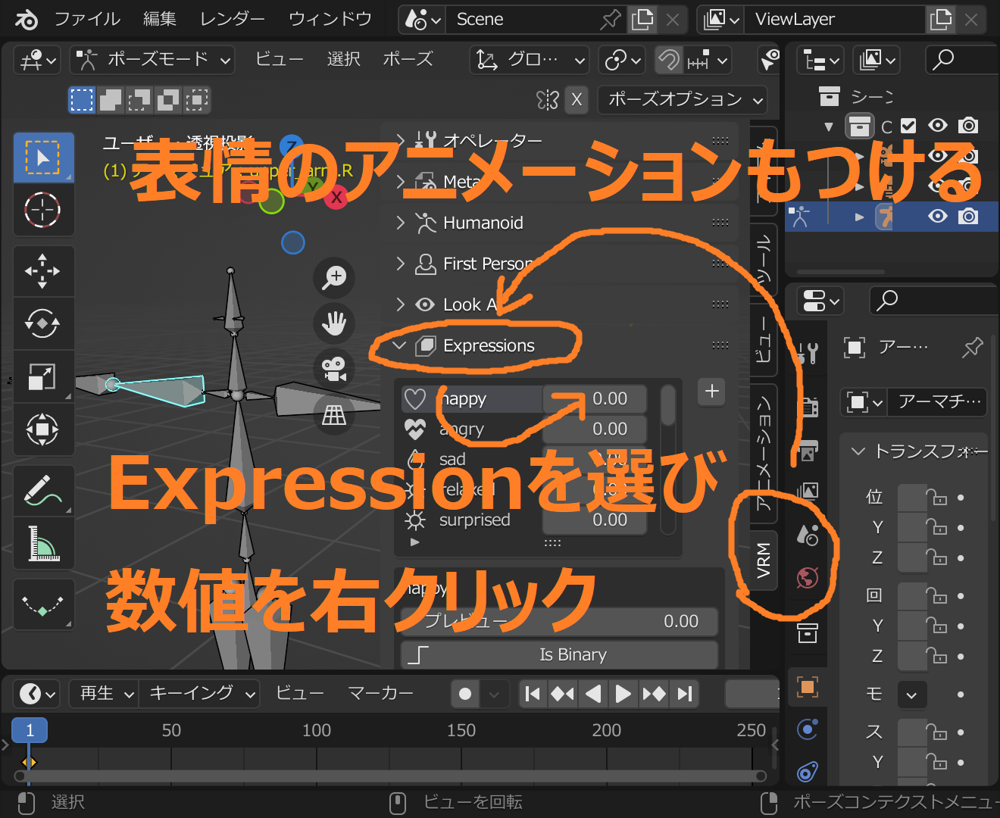
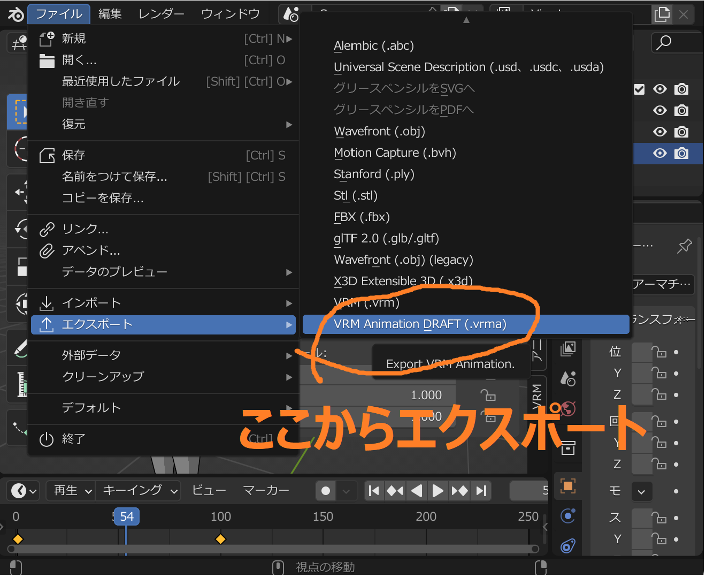

An English tutorial is currently being written.

---

VRM Animationのインポートとエクスポートの解説です。執筆時点ではまだ仕様がDraftのため、今後変更される可能性があります。

<!-- TableOfContentsの設定は自動でやりたい -->

- [VRM Animationファイルのエクスポート](#vrm-animationファイルのエクスポート)
- [VRM Animationファイルのインポート](#vrm-animationファイルのインポート)

## VRM Animationファイルのエクスポート

VRM Animationのエクスポートには、VRM 1.0のアーマチュアが必要です。エクスポートされるアニメーションは次の通りです

- Humanoidボーンの回転値
- Humanoid Hipsボーンの移動値
- Expressionのプレビュー値
  (Look At値のエクスポートは現在未対応)

最低限のアニメーションをエクスポートしてみます。

## VRM Animationファイルのインポート

