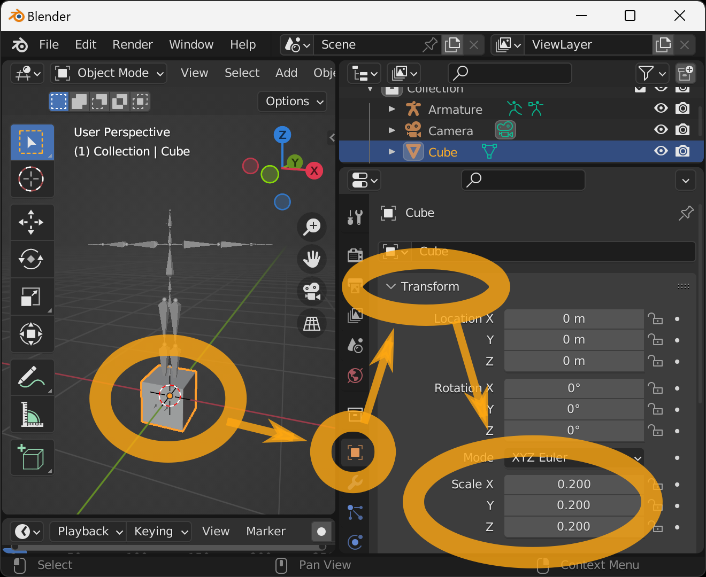
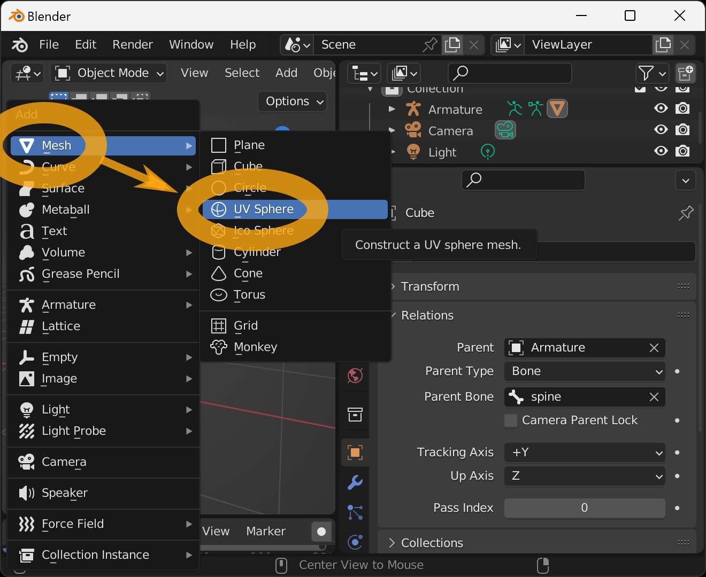
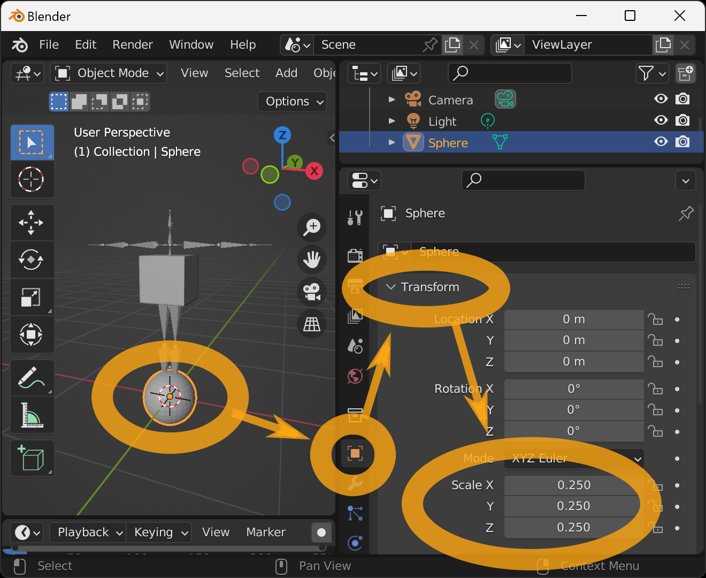
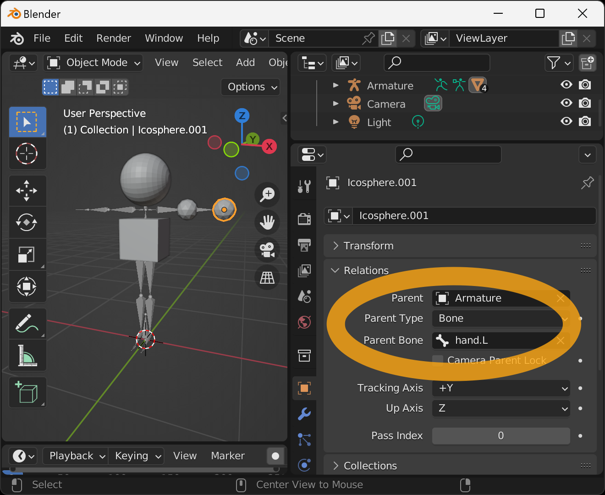

We will create a simple Humanoid VRM model.

After starting Blender, place the mouse cursor on the 3D Viewport and press the `n` key.

This will open a Sidebar from the right side. Select the `VRM` tab and click the `Create VRM Model` button.

Then an armature suitable for VRM output will be created automatically. An armature represents the bone structure of a 3D model.
This add-on uses armature to represent the skeletal structure of the human figure in VRM.

We will use the default Cube as a torso.

Select the Cube in the 3D Viewport, select the tab with the "" icon in the lower right corner, go to `Transform` > `Scale`, and set all values to `0.2` to make it small enough to be used as a torso.

We associate the torso with the bones of the armature. Go to `Relations`, and set `Parent` to `Armature`, `Parent Type` to `Bone`, and `Parent Bone` to `spine`. The torso will move to the spine of the 3D model.

The next step is to create the head, press `Shift + a` in the 3D viewport to bring up an additional menu, select `Mesh` -> `UV Sphere`.

A `Sphere` will be added.

It is too big so we will shrink it.

Select the tab with the "" icon in the lower right corner, go to `Transform` > `Scale`, and set all values to `0.25`.

Associate this sphere with the armature's bone. Go to `Relations`, and set `Parent` to `Armature`, `Parent Type` to `Bone`, and `Parent Bone` to `head`. The sphere will move to the head of the 3D model.

Next, we will add the limbs: in the 3D viewport, press `Shift + a` to bring up the Add menu, and select `Mesh` -> `Ico Sphere`.

The `Icosphere` will be added, and at the same time, you will see `> Add Ico Sphere` in the lower-left corner of the 3D viewport. Click on this message.

You can then set up the new Ico Sphere to be added. We feel that the radius is too large so we will change the radius value to `0.1 m`.

Select the tab with the "" icon in the lower right corner, go to `Relations`, set `Parent` to `Armature`, set `Parent Type` to `Bone`, and set `Parent Bone` to `upper_arm.L`. The sphere will move to the left upper arm of the 3D model.

Add the Ico sphere as before, and now associate it with the `hand.L` bone. The Ico sphere will move to the left hand.

Similarly, we will associate it with the `upper_arm.R` bone.

Associate with the `hand.R` bone.

Associate with the `upper_leg.L` bone.

Associate with the `lower_leg.L` bone.

Associate with the `upper_leg.R` bone.

Finally, associate it with the `lower_leg.R` bone.

Save this model as a VRM. Select `File` → `Export` → `VRM (.vrm)` from the menu.

Enter the filename and destination when the File View window appears and press `Export VRM`.

If successful, the VRM file will be saved to the specified location.

You can check the operation on this page.

- https://hub.vroid.com/en/characters/6595382014094436897/models/1372267393572384142

## Links

- [Top]()
- [Create Simple VRM]()
