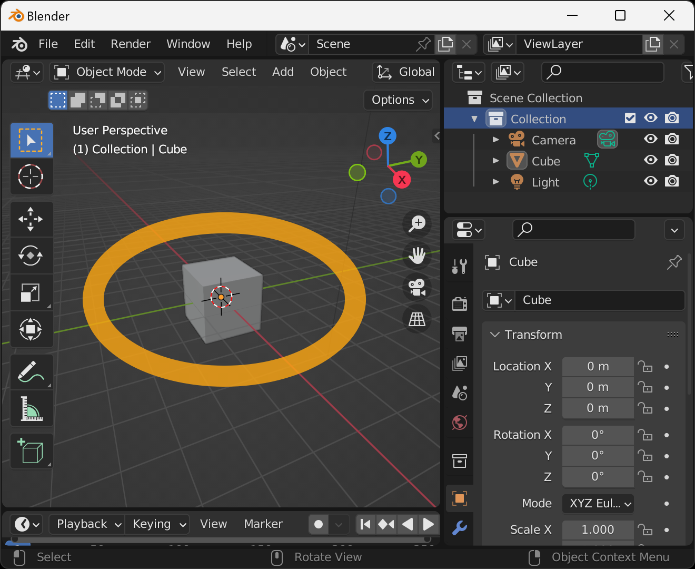

Convert the cube displayed from the beginning when you start Blender to a VRM model.

First, start Blender and make sure that the cube is displayed.

Next, select `File` → `Export` → `VRM (.vrm)` from the menu.

Enter the filename and destination when the File View window appears and press `Export VRM`.

If successful, the VRM file will be saved to the specified location.

You can check the operation on this page.

- https://hub.vroid.com/en/characters/2535511199028537879/models/127230567429676411

## Links

- [Top]()
- [Create Humanoid VRM]()
