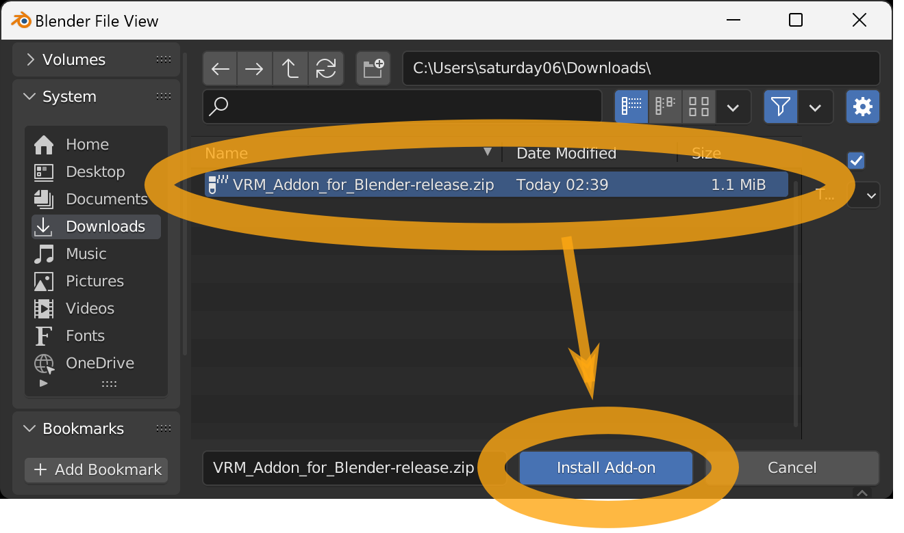
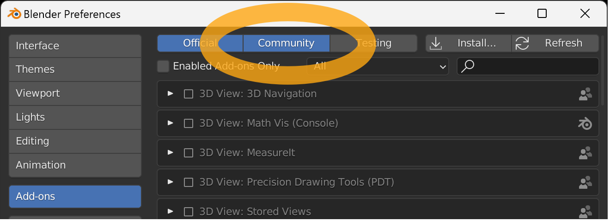
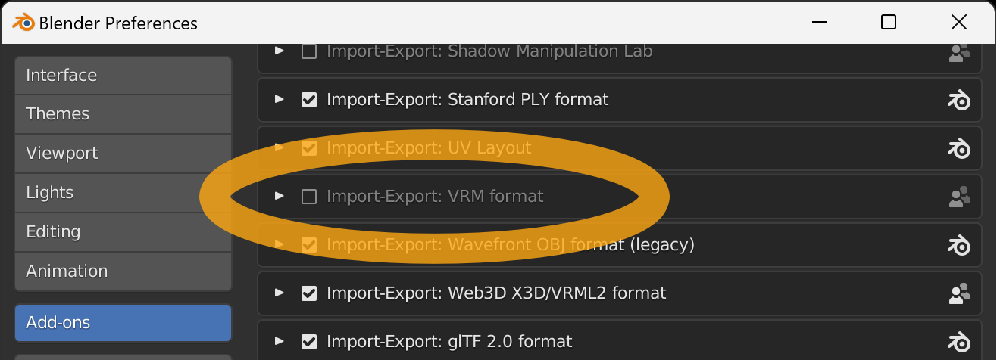
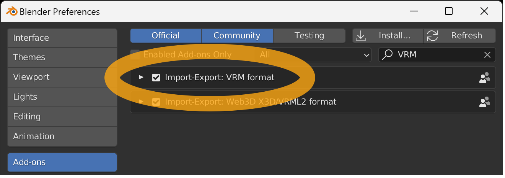

_This tutorial is for Blender 2.93 to 4.1. For Blender 4.2 or later, please download and install from [Blender Extensions Platform (https://extensions.blender.org/add-ons/vrm)](https://extensions.blender.org/add-ons/vrm)._

Download latest add-on file from **[Download Latest Version ](https://vrm-addon-for-blender.info/releases/VRM_Addon_for_Blender-release.zip)**

The downloaded add-on file is a ZIP file, but <u>please do not unzip it</u>, as the unzipped data will not function as an add-on.

Start Blender and select menu `Edit` → `Preferences`.

Select `Add-ons` from the left menu when the preferences screen, and then press the `Install` button in the upper right corner.

When the File View window appears, select the add-on file you just downloaded, make sure the filename ends with `.zip`, and press the `Install Add-on` button.

Make sure `Community` is enabled.

Find `Import-Export: VRM format` in the add-on list view.

There is a search box in the upper right corner if there are too many items to find.

If you cannot find it, please make sure that all of the following conditions are met

- The add-on file you downloaded is a ZIP file, but <u>you did not unzip it</u>.
- The selected add-on filename ends with `.zip`.
- `Community` at the top of the window is enabled.

Press the checkbox to complete the installation of the add-on.

## Related links

- [Top]()
- [Create Simple VRM]()
- [Create Humanoid VRM]()
