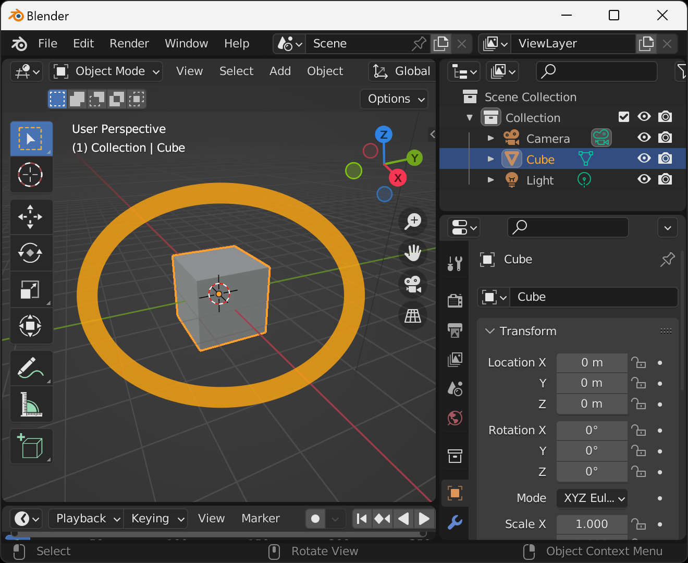
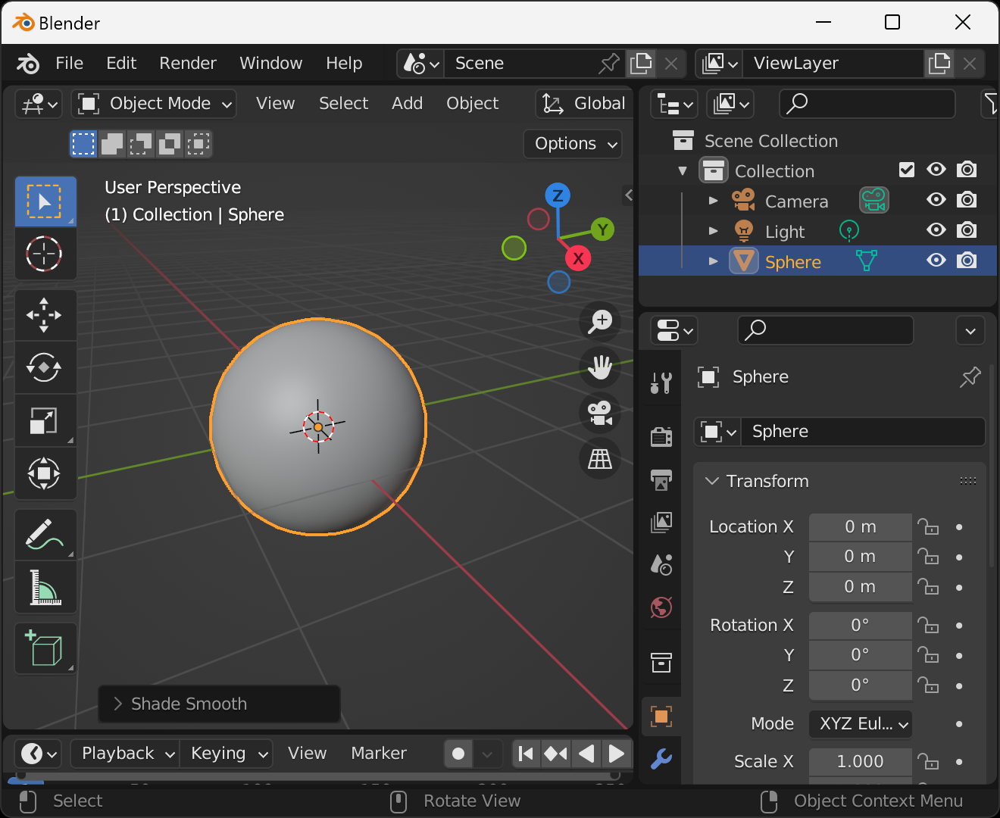
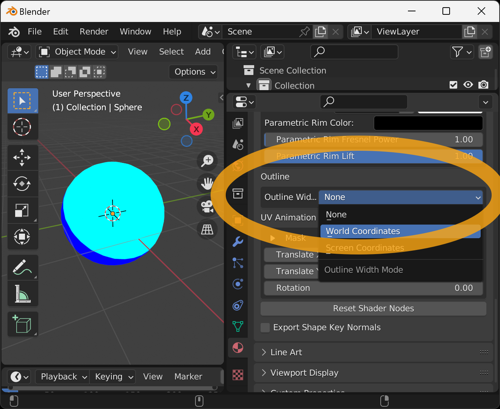
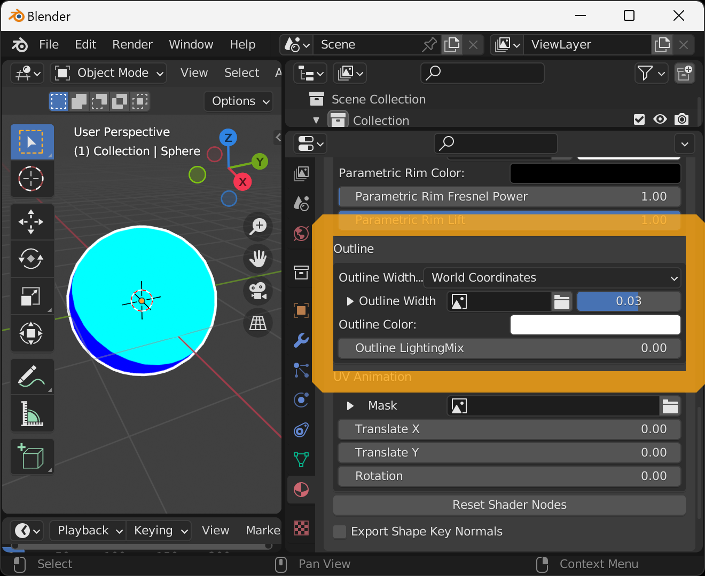
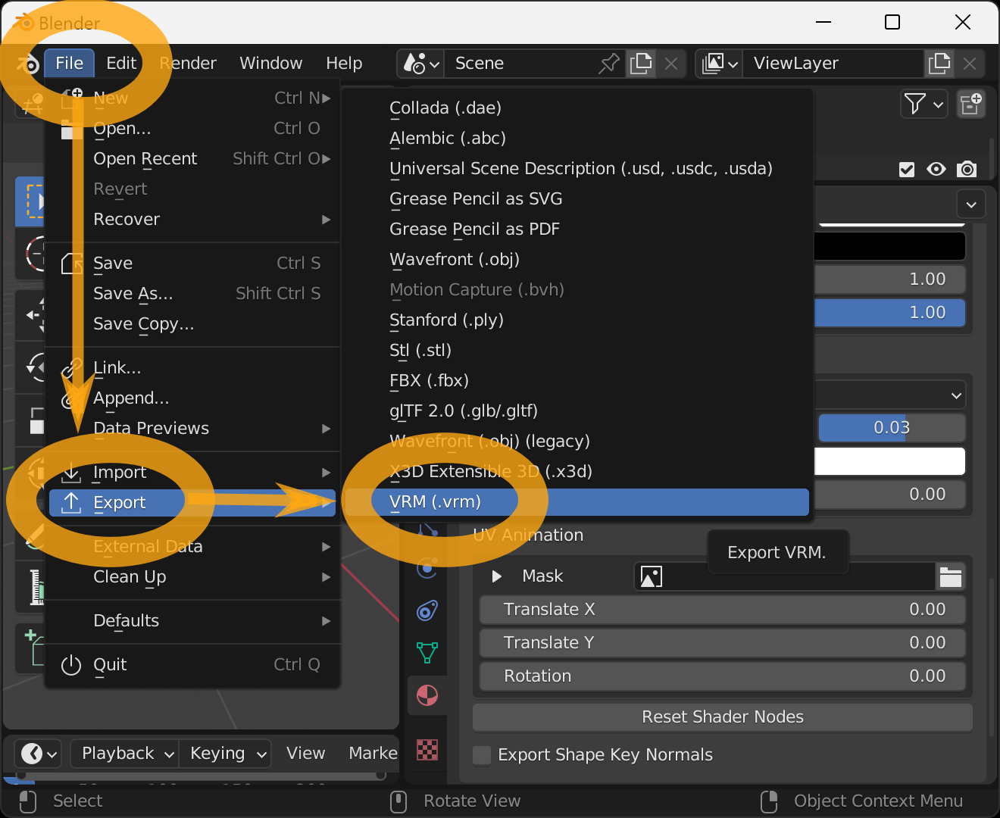

Set an anime-style material to VRM.

Please refer to the VRM documentation for detailed configuration items

https://vrm.dev/en/univrm/shaders/shader_mtoon

After starting Blender, delete the cube that is displayed from the beginning. First, select the cube by left-clicking on it.

When selected, the cube will turn orange around it. In this state, press the `x` key on your keyboard.

Press the `Enter` key on the keyboard to confirm the deletion.

If successful, the cube will be deleted.
Next, add a sphere.
With the cursor in the 3D viewport, hold down the `Shift` key on your keyboard and press the `a` key.
The Add Object menu will appear, select `Mesh` → `UV Sphere`.

Success is indicated when a sphere consisting of a square surface is displayed.

Next, smooth the surface of this sphere to make it more spherical. Click on the `Object` menu at the top of the screen and select `Shade Smooth` from there.

It is successful when the corners are removed and the sphere looks like a smooth sphere.

Next, we can check the color of the material.

With the cursor in the 3D viewport, press the `z` key on the keyboard to bring up the preview display selection menu.
Then move the mouse down and select `Rendered`.

If successful, the direction of the unlit areas will change. However, there is little change in the display, but note that the coloring is not reflected in the display if the default setting is used.

Next, set the view transformation settings. Select the tab with the "" icon in the lower right corner, then go to `Color Management` and set `View Transform` to `Standard`.

The sphere will be slightly brighter. If the default is left unchanged, the color displayed will be darker than the specified color.

Next, configure the material settings. Select the tab with the "" icon in the lower right corner and press the `New` button.

A material named `Material.001` will be added. Then scroll down the view and under `VRM Material` check the `Enable VRM MToon Material` checkbox.

The display color of the sphere turns white and the VRM anime-style material setting item appears.

As a sample setup, set the following

- Set the `Lit Color, Alpha` to light blue
- Set the `Shade Color` to blue
- Set the `Shading Toony` to 1
- Set the `Shading Shift` to 0

Scroll the display and set the `Outline` item to `World Coordinates`.

When the outline settings appear, set the following as a sample setting.
(This outline display is only compatible with Blender 3.5 or later and 3.3)

- Set the `Outline Width` to 0.03
- Set the `Outline Color` to white
- Set the `Outline LightingMix` to 0

Save this model as a VRM. Select `File` → `Export` → `VRM (.vrm)` from the menu.

Enter the filename and destination when the File View window appears and press `Export VRM`.

If successful, the VRM file will be saved to the specified location.

You can check the operation on this page.

- https://hub.vroid.com/en/characters/2368193253669776229/models/7692418309335351071

## Links

- [Top]()
- [Create Physics Based Material]()
