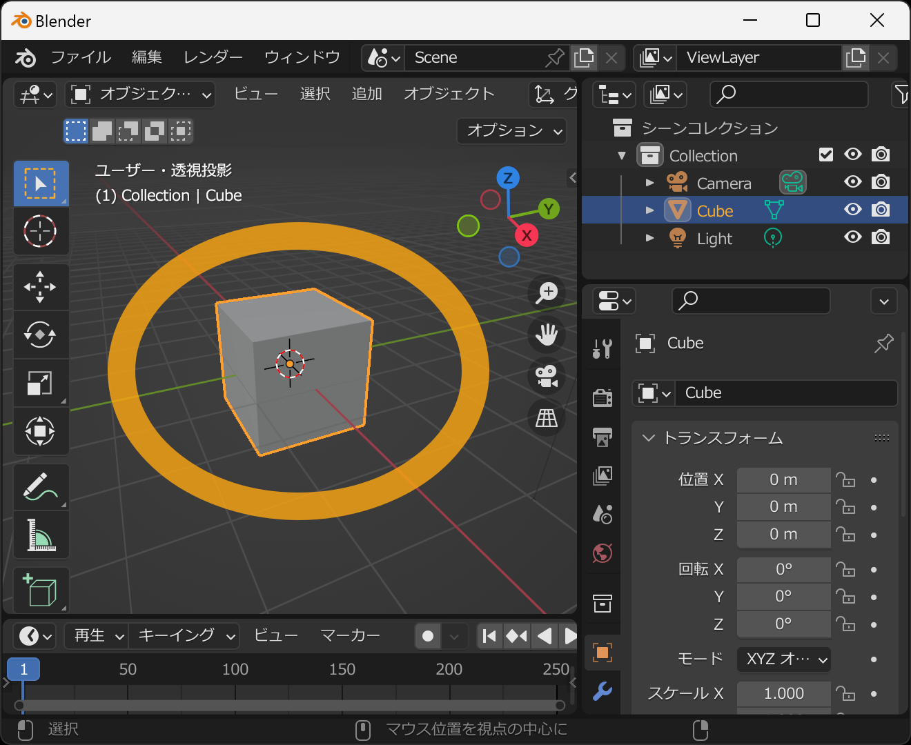
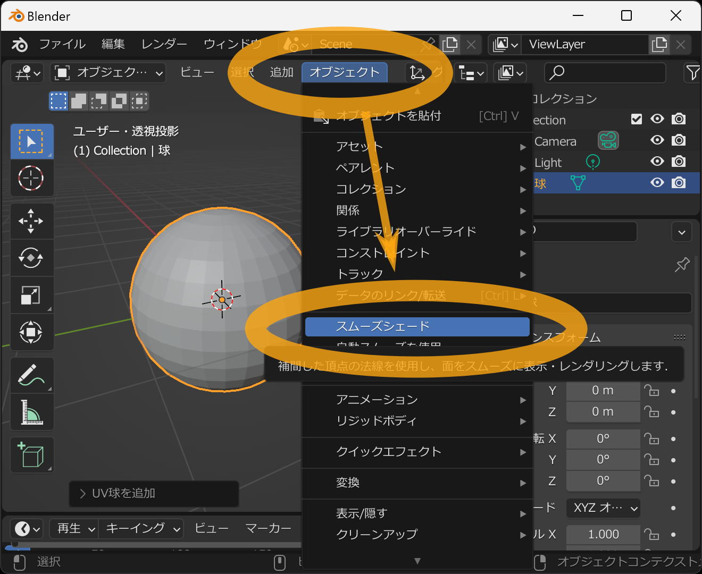
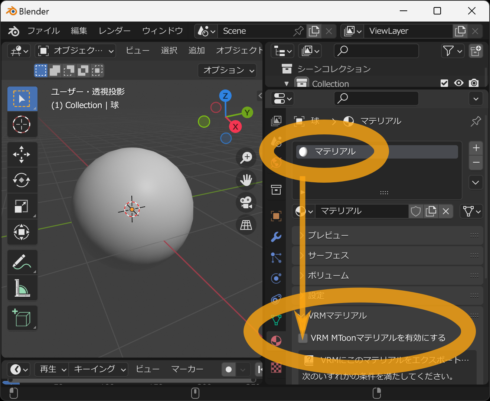
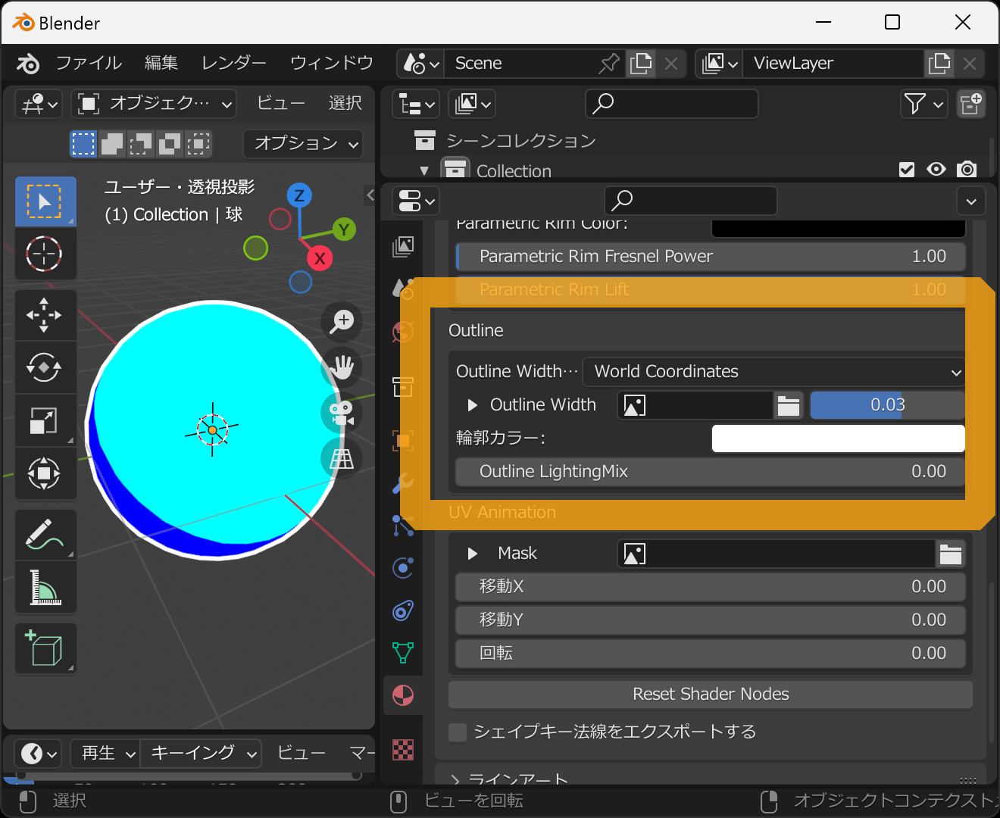
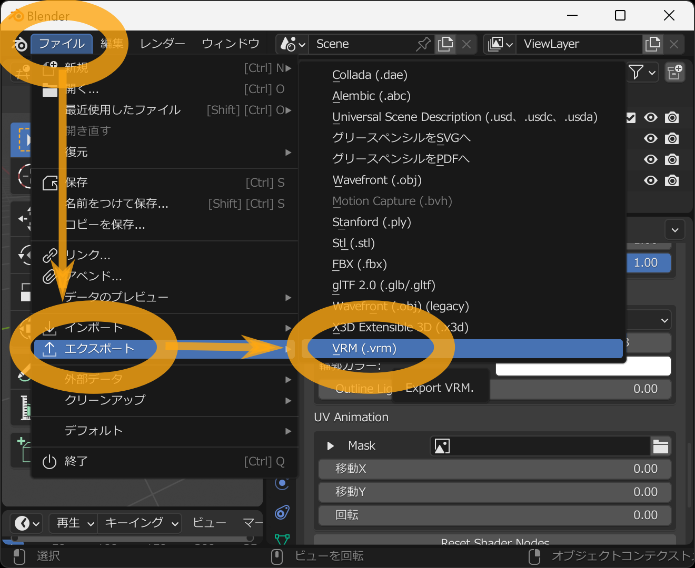

アニメ風マテリアルをVRMに設定します。

詳しい設定項目についてはVRMのドキュメントを参照ください

https://vrm.dev/univrm/shaders/shader_mtoon

Blenderを起動したら、まずは初めから表示されている立方体を削除します。
まずはその立方体にマウスの左クリックして選択します。

選択すると、立方体の周りがオレンジ色になります。その状態でキーボードの `x` キーを押してください。

削除の確認表示がされるので、そのままキーボードの `Enter` キーを押してください。

成功すると立方体が削除されます。次に、マテリアルを設定用の球を追加します。3Dビューポート内にカーソルを置いた状態で、キーボードの `Shift` キーを押したまま `a` キーを押してください。するとオブジェクトの追加メニューが表示されるため `メッシュ` → `UV球` を選択してください。

四角い面からなる球が表示されたら成功です。

次に、この球の面をスムーズにして、より球らしくします。画面上部の `オブジェクト` メニューをクリックし、そこから `スムースシェード` を選択してください。

角がとれてスムーズな球に見えるようになったら成功です。

次にマテリアルの色をプレビューできるようにします。
3Dビューポート内にカーソルを置いた状態で、キーボードの `z` キーを押すことでプレビュー表示選択メニューが出ます。
その状態でマウスを下に移動し `レンダー` を選択します。

成功すると、光が当たっていない部分の方向が変わります。とはいえ表示の変化はほとんどないですが、デフォルトのままだと色つけても表示に反映されないので注意してください。次にビュー変換の設定をします。右下の「」アイコンのタブを選び、`カラーマネジメント` から `ビュー変換` を `標準` にします。

球が若干明るくなります。デフォルトのままだと表示される色が指定した色よりも暗めになります。次にマテリアルの設定を行います。右下の「」アイコンのタブを選び `新規` ボタンを押します。

`マテリアル` という名前のマテリアルが追加されます。次に表示を下にスクロールして `VRMマテリアル` の項目から `VRM MToonマテリアルを有効にする` のチェックボックスをオンにします。

球の表示色が白くなり、VRMのアニメ風マテリアルの設定項目が出現します。

サンプル設定として、次のように設定します。

- `Lit Color, Alpha` を水色
- `Shade Color` を青
- `Shading Toony` を1
- `Shading Shift` を0

表示をスクロールし `Outline` の項目を `World Coordinates` にします。

アウトラインの設定が出るので、サンプル設定として次のように設定します。
(※こちらのアウトライン表示は、Blender 3.5系以降と3.3系のみの対応になります)

- `Outline Width` を0.03
- `輪郭カラー` を白
- `Outline LightingMix` を0

このモデルをVRMとして保存します。メニューの `ファイル` → `エクスポート` → `VRM (.vrm)` を選択します。

ファイル保存用のウィンドウが出るので、ファイル名と保存先を入力し `VRMをエクスポート` を押します。

成功するとVRMファイルが指定された場所に保存されます。

こちらのページで動作確認ができます。

- https://hub.vroid.com/characters/2368193253669776229/models/7692418309335351071

## 関連リンク

- [トップページ]()
- [物理ベースのマテリアル設定]()
