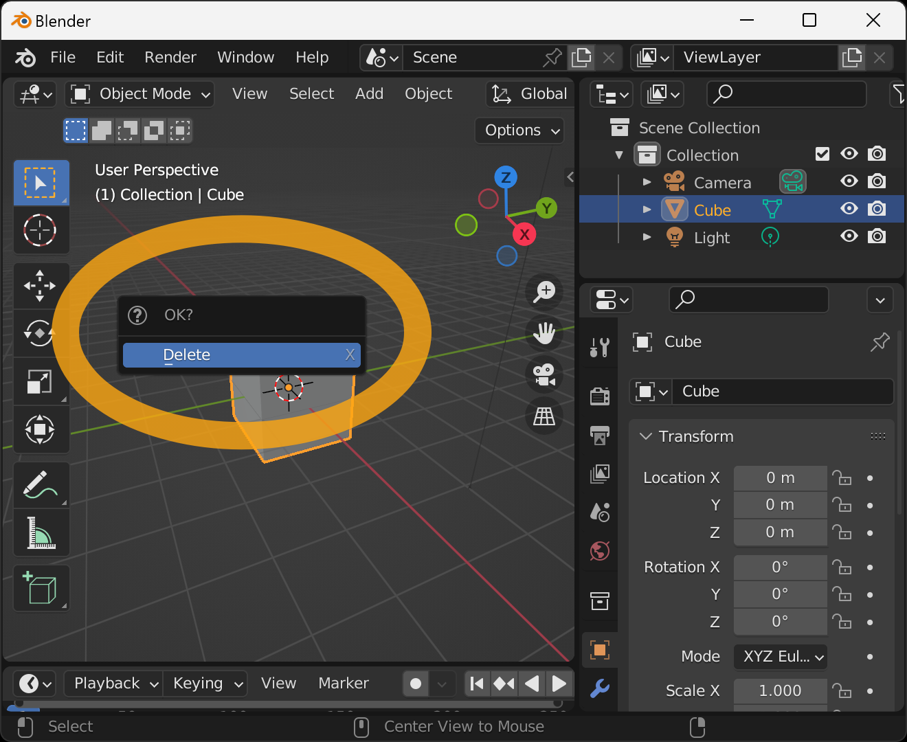
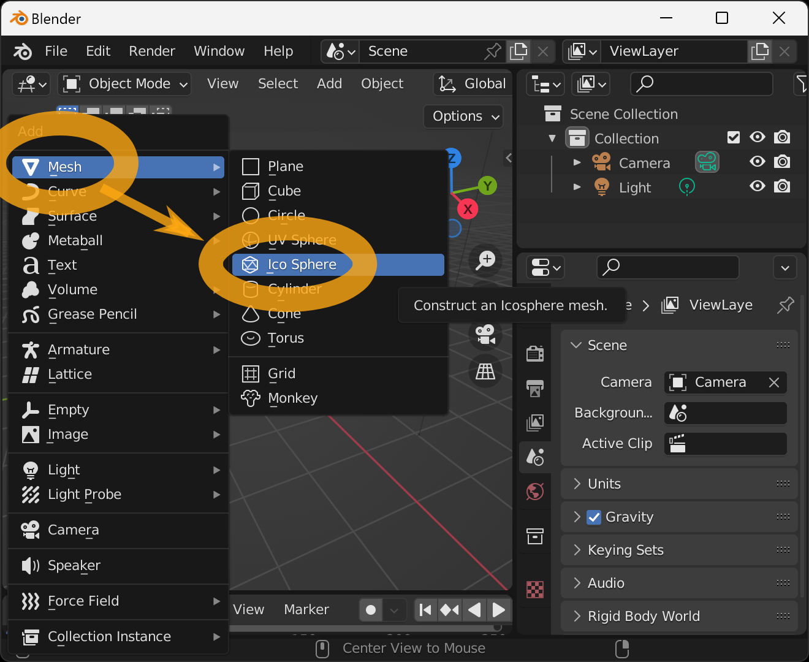
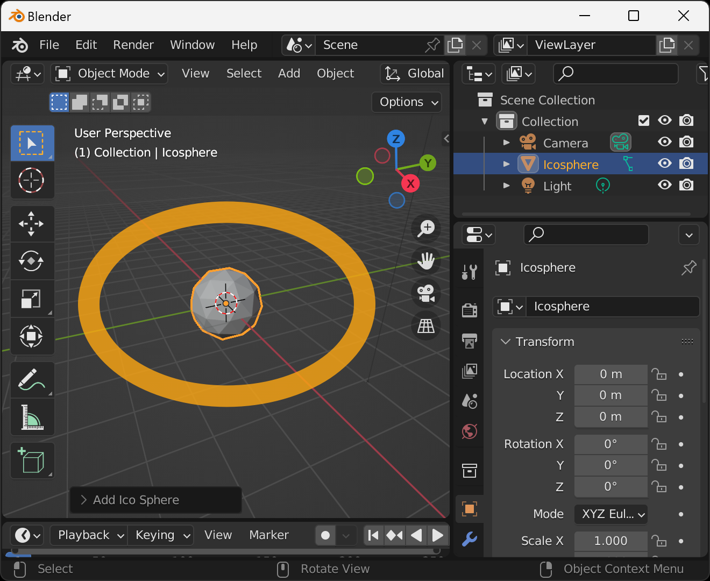
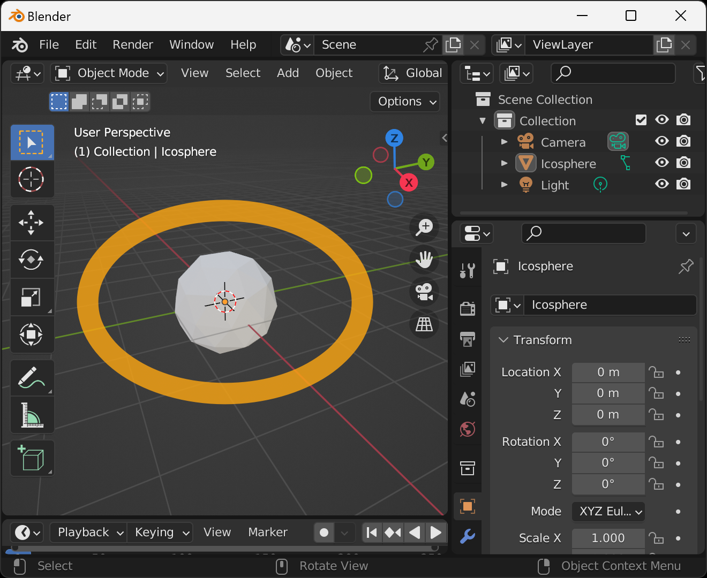
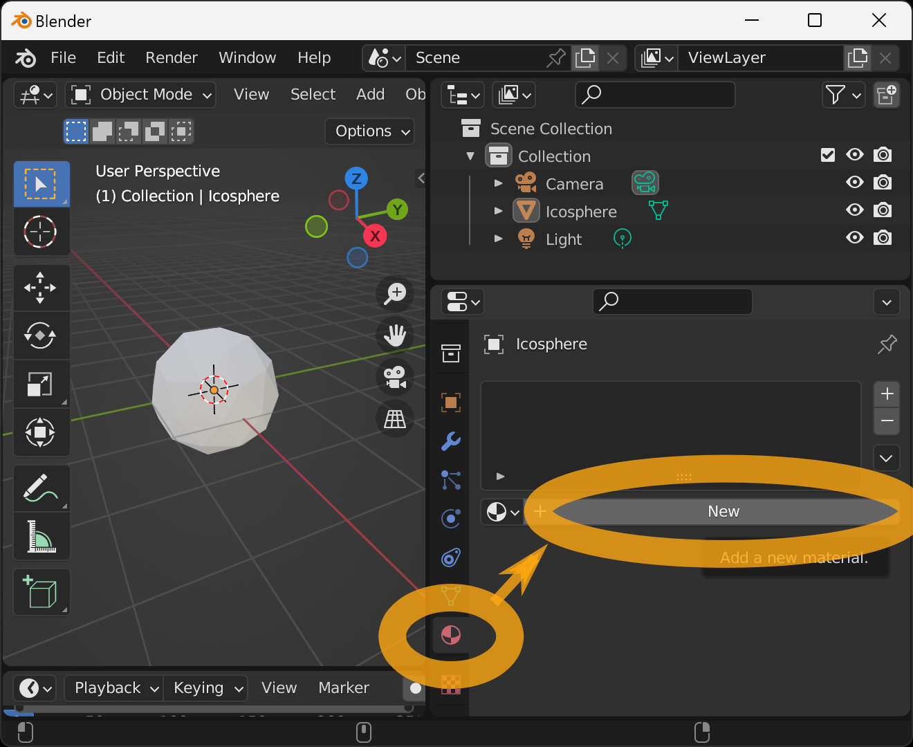
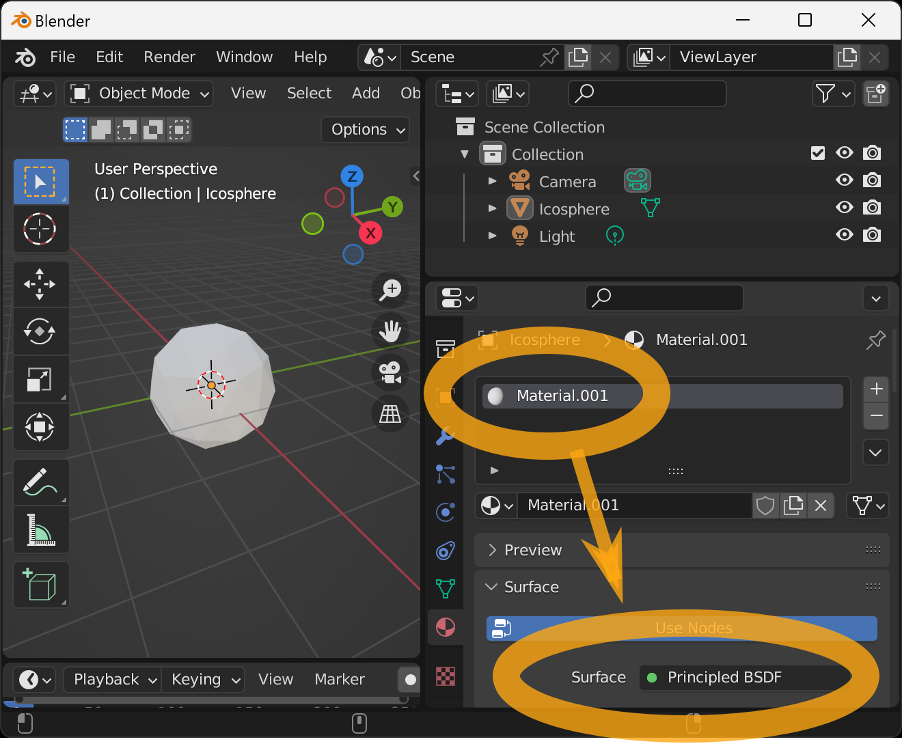
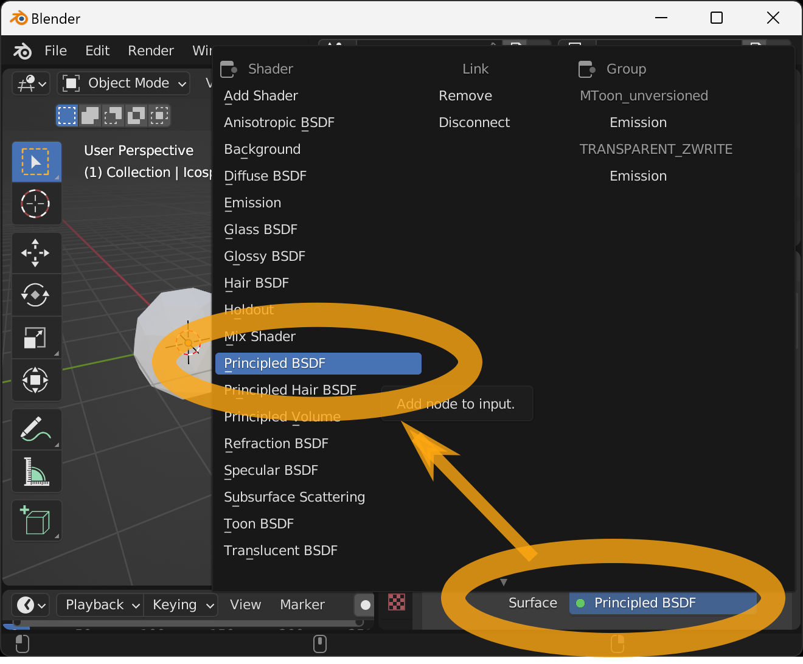
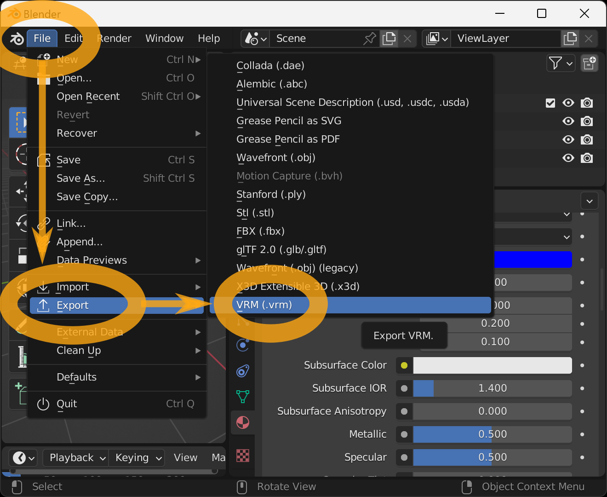

Set up realistic physics-based materials for VRM.

In VRM Add-on for Blender, realistic physics-based material settings are handled exactly the same way as in Blender's glTF 2.0 add-on. Please refer to the appropriate documentation for more information.

https://docs.blender.org/manual/en/2.93/addons/import_export/scene_gltf2.html#exported-materials

After starting Blender, delete the cube that is displayed from the beginning. First, select the cube by left-clicking on it.

When selected, the cube will turn orange around it. In this state, press the `x` key on your keyboard.

Press the `Enter` key on the keyboard to confirm the deletion.

If successful, the cube will be deleted.
Next, add a sphere consisting of triangles.
With the cursor in the 3D viewport, hold down the `Shift` key on your keyboard and press the `a` key.
The Add Object menu will appear, select `Mesh` → `Ico Sphere`.

If successful, a sphere consisting of triangles is added.

Next, we can check the color of the material.

With the cursor in the 3D viewport, press the `z` key on the keyboard to bring up the preview display selection menu.
Then move the mouse down and select `Material Preview`.

If successful, the grayish color of the display will increase. However, there is little change, but note that the coloring is not reflected in the display if the default is used.

In this state, set the material settings. Select the tab with the "" icon in the lower right corner and press the `New` button.

A material named `Material.001` will be added.
Also make sure that the `Surface` setting is set to `Principled BSDF`.

By setting the `Principled BSDF`, you can configure realistic physics-based texture settings, which can then be exported directly to VRM.

Then select `Base Color` and enter blue when the color selection pop-up appears.

Then set the value of `Metallic` to `0.5`.

Save this model as a VRM. Select `File` → `Export` → `VRM (.vrm)` from the menu.

Enter the filename and destination when the File View window appears and press `Export VRM`.

If successful, the VRM file will be saved to the specified location.

You can check the operation on this page.

- https://hub.vroid.com/en/characters/3819557420301868457/models/3988362170085862123

## Links

- [Top]()
- [Create Anime Style Material]()
