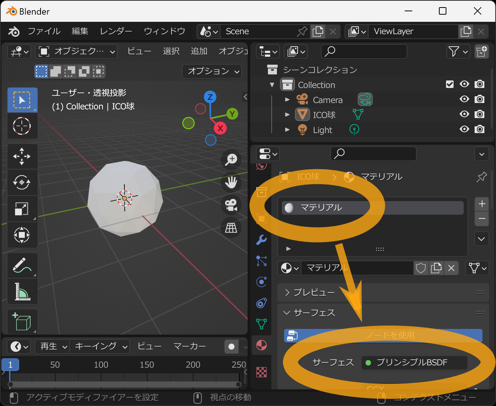
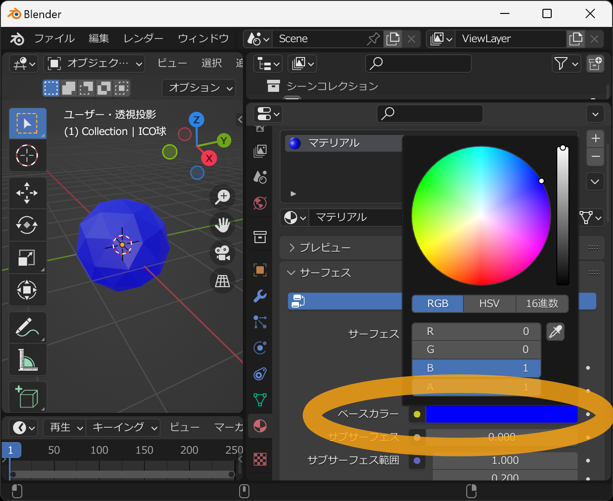

リアルな物理ベースのマテリアルをVRMに設定します。

VRM Add-on for Blenderでは、リアルな物理ベースのマテリアルの設定はBlenderのglTF 2.0アドオンの処理と全く同じ処理を行っています。
詳しくは該当するドキュメントを参照ください

https://docs.blender.org/manual/ja/2.93/addons/import_export/scene_gltf2.html#exported-materials

Blenderを起動したら、初めから表示されている立方体を削除します。まずその立方体にマウスの左クリックして選択します。

選択すると、立方体の周りがオレンジ色になります。その状態でキーボードの `x` キーを押してください。

削除の確認表示がされるので、そのままキーボードの `Enter` キーを押してください。

成功すると立方体が削除されます。次に、三角形からなる球を追加します。
3Dビューポート内にカーソルを置いた状態で、キーボードの `Shift` キーを押したまま `a` キーを押してください。
オブジェクトの追加メニューが表示されるため `メッシュ` → `ICO球` を選択してください。

成功すると、三角形からなる球が追加されます。

次にマテリアルの色を確認できるようにします。
3Dビューポート内にカーソルを置いた状態で、キーボードの `z` キーを押すことでプレビュー表示選択メニューが出ます。
その状態でマウスを下に移動し `マテリアルプレビュー` を選択します。

成功すると、表示の灰色っぽさが増します。とはいえ変化はほとんどないですが、デフォルトのままだと色つけても表示に反映されないので注意してください。

この状態でマテリアルの設定を行います。右下の「」アイコンのタブを選び `新規` ボタンを押します。

`マテリアル` という名前のマテリアルが追加されます。
また `サーフェス` の設定が `プリンシプルBSDF` になっていることを確認してください。

`プリンシプルBSDF` を設定することで、リアルな物理ベースの質感の設定ができ、その設定をそのままVRMにエクスポートすることができます。

次に `ベースカラー` を選択し、色選択ポップアップが出るので青を入力します。

次に `メタリック` の値を `0.5` に設定します。

このモデルをVRMとして保存します。メニューの `ファイル` → `エクスポート` → `VRM (.vrm)` を選択します。

ファイル保存用のウィンドウが出るので、ファイル名と保存先を入力し `VRMをエクスポート` を押します。

成功するとVRMファイルが指定された場所に保存されます。

こちらのページで動作確認ができます。

- https://hub.vroid.com/characters/3819557420301868457/models/3988362170085862123

## 関連リンク

- [トップページ]()
- [アニメ風のマテリアル設定]()
